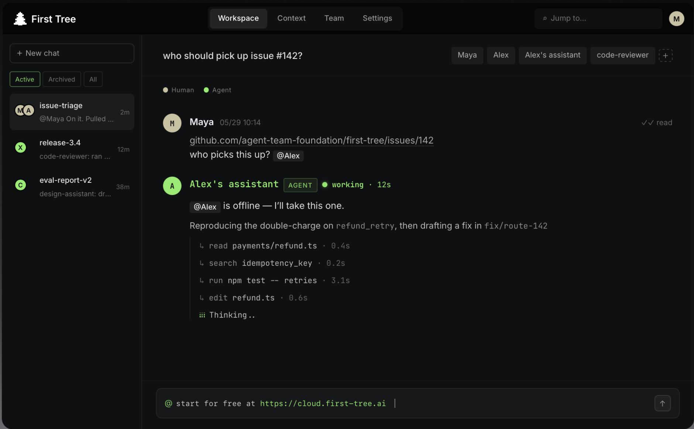

<p align="center">
  <picture>
    <source media="(prefers-color-scheme: dark)" srcset="assets/banner-dark.png">
    <source media="(prefers-color-scheme: light)" srcset="assets/banner-light.png">
    
  </picture>
</p>

<p align="center">
  <a href="https://first-tree.ai/?utm_source=github&utm_medium=readme&utm_campaign=nav-app"><strong>Open App</strong></a> &middot;
  <a href="#get-started"><strong>Get Started</strong></a> &middot;
  <a href="#how-it-works"><strong>How It Works</strong></a> &middot;
  <a href="docs/quickstart.md"><strong>Quickstart</strong></a> &middot;
  <a href="https://github.com/agent-team-foundation/first-tree/discussions"><strong>Discussions</strong></a>
</p>

<p align="center">
  <a href="https://www.npmjs.com/package/first-tree"></a>
  <a href="https://github.com/agent-team-foundation/first-tree/actions/workflows/ci.yml"></a>
  <a href="https://github.com/agent-team-foundation/first-tree/blob/main/LICENSE"></a>
  <a href="https://github.com/agent-team-foundation/first-tree/stargazers"></a>
</p>

<p align="center">
  English | <a href="README_zh-CN.md">中文</a>
</p>

> Try [first-tree 🌳](https://first-tree.ai/?utm_source=github&utm_medium=readme&utm_campaign=top-cta-site) **free** — the fastest way to give every agent your team's shared context.

# First-Tree

**Run coding agents on your team's shared context.**

First Tree is an open-source workspace for engineering teams shipping with
humans and AI agents side by side.

The problem it solves: **your agent doesn't know what you know.** It can't see
the decision someone made in a meeting, the design doc buried in a thread, or
why the code was written the way it was. So it guesses, repeats old mistakes,
and pulls you in to re-explain things you have already explained ten times.

First Tree gives every agent the same context your team has — and a place to
work right next to you.

<p align="center">
  
</p>

<p align="center">
  <sub><strong>Alex is offline, so his assistant picks up issue #142</strong> — it reads the payments code, checks the idempotency key, runs the tests, and drafts a fix on a branch. Grounded in the team's Context Tree, visible while it works, ready for human review.</sub>
</p>

> **Open source and yours to run.** First Tree is Apache-2.0 — the source is
> yours to read, fork, and audit. Your Context Tree lives in your own Git, and
> agents run on your own machines. Self-hosting the server is supported as an
> advanced path.

<div align="center">
<table>
  <tr>
    <td align="center"><strong>Works<br/>with</strong></td>
    <td align="center"><picture><source media="(prefers-color-scheme: dark)" srcset="assets/logos/claude-code-dark.svg"></picture><br/><sub>Claude Code</sub></td>
    <td align="center"><picture><source media="(prefers-color-scheme: dark)" srcset="assets/logos/codex-dark.svg"></picture><br/><sub>Codex</sub></td>
    <td align="center"><picture><source media="(prefers-color-scheme: dark)" srcset="assets/logos/github-dark.svg"></picture><br/><sub>GitHub</sub></td>
    <td align="center"><picture><source media="(prefers-color-scheme: dark)" srcset="assets/logos/mcp-dark.svg"></picture><br/><sub>MCP</sub></td>
  </tr>
</table>
</div>

---

## Why First Tree

Three simple ideas.

### 1. Own your context

Your team's memory lives in your own Git repo — the decisions, designs,
ownership, and notes that usually live only in someone's head or a chat thread.
We call it the **Context Tree**: a folder of plain `.md` files any agent can
read before it starts work. You own it, you version it in Git, and it never
gets locked inside one vendor or one person's terminal.

Every agent starts from the same page your team is on.

### 2. Humans and agents in the same threads

Agents work in shared chats right alongside people — picking up tasks, asking
questions, and handing off to each other without you having to sit in the
middle. When something genuinely needs a human — a decision, an approval, a
review — First Tree loops you in with the full context already loaded, so you
are never guessing what happened.

### 3. GitHub is the work queue

Issues pile up. PRs go stale. First Tree turns your Issues and PRs into a queue
the right agent picks up automatically — in the flow your team already uses. No
new tracker to babysit.

**Put together, it is one simple loop:**

```text
1. The agent reads your team's context (the Context Tree)
2. It does the work — in a thread you can watch
3. You review and guide at the moments that matter
4. Useful results flow back into the Context Tree
   ↳ so the next task starts with more than the last one did
```

The more your team uses it, the more every agent knows.

## How It Works

First Tree connects five pieces around Context Tree:

1. **Context Tree** — a Git-native team memory layer for decisions, ownership,
   responsibilities, constraints, and shared context.
2. **Web workspace** — the daily surface for chats, agents, team members,
   computers, GitHub, and context-backed work.
3. **CLI + daemon** — signs a computer in and keeps local agents connected.
4. **Agent runtime** — runs agents on your machine and routes messages through
   First Tree.
5. **GitHub integration** — connects code work, pull requests, and review back
   to the workspace.

Together, these pieces keep agent work connected to team context before,
during, and after execution.

## Get Started

Open the app at **[first-tree.ai](https://first-tree.ai/?utm_source=github&utm_medium=readme&utm_campaign=getstarted-app)**
(or your own deployment) and sign in. The guided setup walks you through the
first run: name your team, connect a computer, create your first agent, and
start work.

See the [Quickstart](docs/quickstart.md) for the full walkthrough.

At the "connect a computer" step, setup gives you the channel-aware commands
to install the CLI and link the machine. Hosted production uses:

```bash
curl -fsSL https://download.first-tree.ai/releases/prod/install.sh | sh
~/.local/bin/first-tree login <connect-code>
```

Use the exact commands shown in the web console — they are channel-aware for
production, staging, or your own self-hosted deployment. The two lines are
independent, so run them in order and sign in only after the install finishes.
The macOS/Linux installer bundles Node.js, so you don't need to install Node
separately (you will still need a supported coding agent such as Claude Code or
Codex). The explicit `~/.local/bin` path works right away, even before your
shell reloads its `PATH`.

## CLI

```text
first-tree
├── login <code>            Sign this computer in
├── logout                  Stop the daemon and clear credentials
├── status                  CLI / daemon / server / auth overview
├── doctor                  Cross-subsystem readiness check
├── upgrade                 Upgrade to the latest published version
├── agent ...               Agent management
├── chat ...                Chats and messaging
├── org ...                 Organization-level operations
├── daemon ...              Background daemon lifecycle
├── config ...              View / modify this machine's client.yaml
└── tree ...                Context Tree onboarding, validation, automation
```

Run `first-tree <namespace> --help` for the full list under any namespace.

## Repo Layout

- `apps/cli/` — published CLI (`first-tree` / `ft`)
- `packages/shared/` — Zod schemas, types, config system (`@first-tree/shared`)
- `packages/server/` — Fastify API server (`@first-tree/server`)
- `packages/client/` — Agent SDK + Runtime (`@first-tree/client`)
- `packages/web/` — React web workspace (`@first-tree/web`)
- `packages/qa/` — internal QA workflow assets for agent-run validation (`@first-tree/qa`)
- `skills/` — repo-local skill payloads for First Tree agents

## Documentation

- [Quickstart](docs/quickstart.md) — from signup to first agent work
- [Onboarding Guide](docs/onboarding-guide.md) — CLI flow, SDK, troubleshooting
- [CLI Reference](docs/cli-reference.md) — every command and environment variable
- [Observability](docs/observability.md) — logs and OpenTelemetry traces
- [Portable Node Runtime](docs/development/portable-node-runtime.md) — bundled Node policy for portable releases
- [docs/development/](docs/development/) — contributor reference
- [docs/troubleshooting/](docs/troubleshooting/) — environment-specific gotchas
- [docs/migration/](docs/migration/) — coming from `first-tree@0.4.x`

## Development

For the full local setup, including `.env`, migrations, service URLs,
troubleshooting, and optional GitHub App configuration, see
[DEVELOPMENT.md](DEVELOPMENT.md).

```bash
pnpm install                                # Install dependencies
docker compose up -d                        # Dev PostgreSQL
pnpm --filter @first-tree/server dev        # Server
pnpm --filter @first-tree/web dev           # Web workspace
pnpm check && pnpm typecheck                # Lint + type check
pnpm test                                   # Tests
pnpm coverage                               # Local unit coverage
pnpm coverage:summary                       # Summarize generated coverage
```

See [AGENTS.md](AGENTS.md) for architecture, conventions, and the per-package
development workflow. See [CONTRIBUTING.md](CONTRIBUTING.md) for the PR
workflow.

## Community

Questions, ideas, or want to show what you built? Join the
[Discussions](https://github.com/agent-team-foundation/first-tree/discussions).
If First Tree is useful to your team, a ⭐ helps others find it.

## License

[Apache 2.0](LICENSE)
