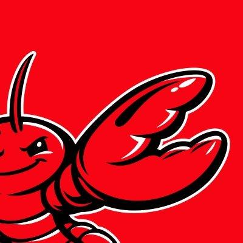

<p align="center">
  <picture>
    <source media="(prefers-color-scheme: dark)" srcset="assets/banner-dark.png">
    <source media="(prefers-color-scheme: light)" srcset="assets/banner-light.png">
    
  </picture>
</p>

<p align="center">
  <a href="https://cloud.first-tree.ai"><strong>Open App</strong></a> &middot;
  <a href="#get-started"><strong>Get Started</strong></a> &middot;
  <a href="#how-it-works"><strong>How It Works</strong></a> &middot;
  <a href="docs/quickstart.md"><strong>Quickstart</strong></a> &middot;
  <a href="https://github.com/agent-team-foundation/first-tree/discussions"><strong>Discussions</strong></a>
</p>

<p align="center">
  <a href="https://www.npmjs.com/package/first-tree"></a>
  <a href="https://github.com/agent-team-foundation/first-tree/actions/workflows/ci.yml"></a>
  <a href="https://github.com/agent-team-foundation/first-tree/blob/main/LICENSE"></a>
  <a href="https://github.com/agent-team-foundation/first-tree/stargazers"></a>
</p>

<p align="center">
  English | <a href="README_zh-CN.md">中文</a>
</p>

# First-Tree

**Context-grounded agentic work for teams.**

First Tree is an open-source workspace where AI agents work from your team's
shared context, not isolated prompts.

At the center is Context Tree: a team-maintained memory of decisions,
ownership, repos, responsibilities, constraints, and prior work. Agents read it
before they work; useful outcomes can flow back into it after the work is done.

The result is a human-agent work loop where every task can start with more team
context, and every useful outcome can make the next task smarter.

<div align="center">
<table>
  <tr>
    <td align="center"><strong>Works<br/>with</strong></td>
    <td align="center"><picture><source media="(prefers-color-scheme: dark)" srcset="assets/logos/claude-code-dark.svg"></picture><br/><sub>Claude Code</sub></td>
    <td align="center"><br/><sub>OpenClaw</sub></td>
    <td align="center"><picture><source media="(prefers-color-scheme: dark)" srcset="assets/logos/codex-dark.svg"></picture><br/><sub>Codex</sub></td>
    <td align="center"><picture><source media="(prefers-color-scheme: dark)" srcset="assets/logos/cursor-dark.svg"></picture><br/><sub>Cursor</sub></td>
    <td align="center"><picture><source media="(prefers-color-scheme: dark)" srcset="assets/logos/gemini-dark.svg"></picture><br/><sub>Gemini CLI</sub></td>
    <td align="center"><picture><source media="(prefers-color-scheme: dark)" srcset="assets/logos/github-dark.svg"></picture><br/><sub>GitHub</sub></td>
    <td align="center"><picture><source media="(prefers-color-scheme: dark)" srcset="assets/logos/mcp-dark.svg"></picture><br/><sub>MCP</sub></td>
  </tr>
</table>
</div>

---

## Why First Tree

There are many AI agent workspaces. First Tree's core difference is the context
loop:

```text
user intent -> read team context -> context-aware agent work
-> human review/control -> durable outcome -> updated team context
```

This loop solves the part that usually breaks when teams start using agents:

- context stays private in one person's terminal, prompt, or notes
- agents repeat old decisions because they cannot see team memory
- work finishes in a chat, PR, or document but never updates the shared context
- humans get pulled in without enough background to make a good decision
- each new agent task starts cold, even when the team already learned something

First Tree is built around a different assumption:

> Agent work should be grounded in team context, visible while it runs, guided
> by humans at the right moments, and turned into durable outcomes that can
> update team memory.

That makes First Tree useful in two modes:

- **Focused copilot work** - collaborate deeply with an agent in a persistent
  work stream for design, coding, writing, research, or problem solving.
- **Parallel review work** - let agents move multiple tasks forward and involve
  you only when a decision, blocker, approval, or review is needed.

In both modes, First Tree gives teams one place to:

- give agents the same Context Tree your team uses
- start and continue agent work in persistent chats
- see active work, blocked states, and human review points
- inspect the process, artifacts, and rationale behind a request
- turn useful outcomes back into updated team context

It is not another agent, and not just another workspace. It is a context loop
for human-agent teams.

## How It Works

First Tree connects five pieces around Context Tree:

1. **Context Tree** — a Git-native team memory layer for decisions, ownership,
   responsibilities, constraints, and shared context.
2. **Web workspace** — the daily surface for chats, agents, team members,
   computers, GitHub, and context-backed work.
3. **CLI + daemon** — signs a computer in and keeps local agents connected.
4. **Agent runtime** — runs agents on your machine and routes messages through
   First Tree.
5. **GitHub integration** — connects code work, pull requests, and review back
   to the workspace.

Together, these pieces keep agent work connected to team context before,
during, and after execution.

## Get Started

Open the app at **<https://cloud.first-tree.ai>** (or your own deployment) and
sign in. Learn more at <https://first-tree.ai>. The guided setup walks you
through the first run: name your team, connect a computer, create your first
agent, connect code, and start work.

See the [Quickstart](docs/quickstart.md) for the full walkthrough.

At the "connect a computer" step, setup gives you the command to install the
CLI and link the machine:

```bash
npm install -g first-tree
first-tree login <connect-token>
```

The binary lives at `first-tree`; a short alias `ft` is also installed.

## CLI

```text
first-tree
├── login <token>           Sign this computer in
├── logout                  Stop the daemon and clear credentials
├── status                  CLI / daemon / server / auth overview
├── doctor                  Cross-subsystem readiness check
├── upgrade                 Upgrade to the latest published version
├── agent ...               Agent management
├── chat ...                Chats and messaging
├── org ...                 Organization-level operations
├── daemon ...              Background daemon lifecycle
├── config ...              View / modify this machine's client.yaml
└── tree ...                Context Tree onboarding, validation, automation
```

Run `first-tree <namespace> --help` for the full list under any namespace.

## Repo Layout

- `apps/cli/` — published CLI (`first-tree` / `ft`)
- `packages/shared/` — Zod schemas, types, config system (`@first-tree/shared`)
- `packages/server/` — Fastify API server (`@first-tree/server`)
- `packages/client/` — Agent SDK + Runtime (`@first-tree/client`)
- `packages/web/` — React web workspace (`@first-tree/web`)
- `packages/e2e/` — black-box e2e harness (`@first-tree/e2e`)
- `skills/` — repo-local skill payloads for First Tree agents

## Documentation

- [Quickstart](docs/quickstart.md) — from signup to first agent work
- [Onboarding Guide](docs/onboarding-guide.md) — CLI flow, SDK, troubleshooting
- [CLI Reference](docs/cli-reference.md) — every command and environment variable
- [Observability](docs/observability.md) — logs and OpenTelemetry traces
- [docs/development/](docs/development/) — contributor reference
- [docs/troubleshooting/](docs/troubleshooting/) — environment-specific gotchas
- [docs/migration/](docs/migration/) — coming from `first-tree@0.4.x`

## Development

```bash
pnpm install                                # Install dependencies
docker compose up -d                        # Dev PostgreSQL
pnpm --filter @first-tree/server dev        # Server
pnpm --filter @first-tree/web dev           # Web workspace
pnpm check && pnpm typecheck                # Lint + type check
pnpm test                                   # Tests
pnpm coverage                               # Local unit coverage
pnpm coverage:summary                       # Summarize generated coverage
```

See [AGENTS.md](AGENTS.md) for architecture, conventions, and the per-package
development workflow. See [CONTRIBUTING.md](CONTRIBUTING.md) for the PR
workflow.

## License

[Apache 2.0](LICENSE)
