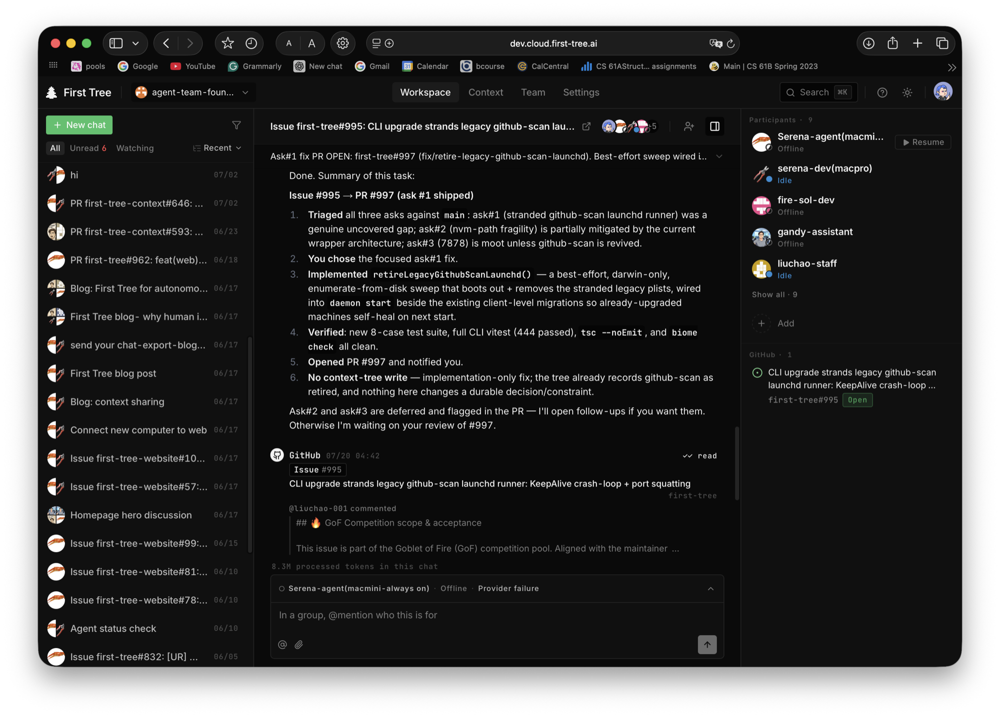

<p align="center">
  <picture>
    <source media="(prefers-color-scheme: dark)" srcset="assets/banner-dark.png">
    <source media="(prefers-color-scheme: light)" srcset="assets/banner-light.png">
    
  </picture>
</p>

<p align="center">
  <a href="https://first-tree.ai/?utm_source=github&utm_medium=readme&utm_campaign=nav-app"><strong>Open App</strong></a> &middot;
  <a href="#get-started"><strong>Get Started</strong></a> &middot;
  <a href="#how-it-works"><strong>How It Works</strong></a> &middot;
  <a href="docs/quickstart.md"><strong>Quickstart</strong></a> &middot;
  <a href="https://github.com/agent-team-foundation/first-tree/discussions"><strong>Discussions</strong></a>
</p>

<p align="center">
  <a href="https://www.npmjs.com/package/first-tree"></a>
  <a href="https://github.com/agent-team-foundation/first-tree/actions/workflows/ci.yml"></a>
  <a href="https://github.com/agent-team-foundation/first-tree/blob/main/LICENSE"></a>
  <a href="https://github.com/agent-team-foundation/first-tree/stargazers"></a>
</p>

<p align="center">
  English | <a href="README_zh-CN.md">中文</a>
</p>

> Try [first-tree 🌳](https://first-tree.ai/?utm_source=github&utm_medium=readme&utm_campaign=top-cta-site) **free** — run more coding agents at once and ship faster, on your own.

# First-Tree

**Run more coding agents at once — and ship software faster.**

First Tree is an open-source workspace for open-source maintainers, indie
developers, and one-person companies who work with coding agents. Spin up
several at once, put each on its own task, and move more work in parallel —
without losing track of what they are all doing.

<p align="center">
  
</p>

<p align="center">
  <sub><strong>Three work streams, three agents, one engineer.</strong> Issue triage, a release, and an eval report all move at once — here one agent picks up issue #142, reproduces the bug, runs the tests, and drafts the fix on a branch while you watch and steer.</sub>
</p>

> **Open source, and yours to run.** First Tree is Apache-2.0 — read it, fork
> it, audit it. Agents run on your own machine and plug into the GitHub repos
> you already work in, with no lock-in. Self-hosting the server is supported as
> an advanced path.

<p align="center">
  
</p>

<p align="center">
  <sub><b>The work loop in practice.</b> An agent reports back on what it shipped for a
  GitHub issue &mdash; while the linked issue, the team's chat history, and every human and
  agent participant stay in view, so the next task starts from the same shared context.</sub>
</p>

<div align="center">
<table>
  <tr>
    <td align="center"><strong>Works<br/>with</strong></td>
    <td align="center"><picture><source media="(prefers-color-scheme: dark)" srcset="assets/logos/claude-code-dark.svg"></picture><br/><sub>Claude Code</sub></td>
    <td align="center"><picture><source media="(prefers-color-scheme: dark)" srcset="assets/logos/codex-dark.svg"></picture><br/><sub>Codex</sub></td>
    <td align="center"><picture><source media="(prefers-color-scheme: dark)" srcset="assets/logos/github-dark.svg"></picture><br/><sub>GitHub</sub></td>
    <td align="center"><picture><source media="(prefers-color-scheme: dark)" srcset="assets/logos/mcp-dark.svg"></picture><br/><sub>MCP</sub></td>
  </tr>
</table>
</div>

---

## Why First Tree

Running one agent is easy. Running five is where it falls apart — you lose
track of what each one is doing, they drift, and reviewing their work eats the
time you saved. First Tree is built for that moment.

### 1. Many agents, in parallel

Start a separate work stream for each task — triage, a bug fix, a release, a
refactor — and let an agent drive each one. They run at the same time, on your
own machine, so you get through far more work without cloning yourself.

### 2. Stay in control without drowning

Every agent works in a thread you can open any time: what it read, what it ran,
what it changed. You step in when a decision or review actually needs you, and
stay out of the way when it does not — so more agents does not mean more chaos.

### 3. Native to GitHub

Have an agent follow an Issue or PR, or @mention / assign / request review from
one, and First Tree routes it straight to the agent working that thread. It
rides on the GitHub events you already fire — no new tracker to babysit.

The result: one person keeps several agents productive at once, and ships a lot
more software.

## How It Works

First Tree is five pieces working together:

1. **Web workspace** — the daily surface where you start agents, watch their
   threads, and steer them.
2. **CLI + daemon** — signs a computer in and keeps your local agents connected.
3. **Agent runtime** — runs agents on your own machine and routes their messages
   through First Tree.
4. **GitHub integration** — wires Issues, PRs, and reviews into the agent
   working that thread.
5. **Context Tree** — a Git-native memory layer agents can read before they
   work (decisions, conventions, gotchas), so they stay consistent as you run
   more of them.

Together, these keep several agents productive and reviewable at once.

## Get Started

Open the app at **[first-tree.ai](https://first-tree.ai/?utm_source=github&utm_medium=readme&utm_campaign=getstarted-app)**
(or your own deployment) and sign in. The guided setup walks you through the
first run: name your team, connect a computer, create your first agent, and
start work.

See the [Quickstart](docs/quickstart.md) for the full walkthrough.

At the "connect a computer" step, setup gives you the channel-aware commands
to install the CLI and link the machine. Hosted production uses:

```bash
curl -fsSL https://download.first-tree.ai/releases/prod/install.sh | sh
~/.local/bin/first-tree login <connect-code>
```

Use the exact commands shown in the web console — they are channel-aware for
production, staging, or your own self-hosted deployment. Run them as two
separate steps: run the login line only after the installer has **succeeded**,
so a failed install never falls through to login. The macOS/Linux installer
bundles Node.js, so you don't need to install Node
separately (you will still need a supported coding agent such as Claude Code or
Codex). The explicit `~/.local/bin` path works right away, even before your
shell reloads its `PATH`.

## CLI

```text
first-tree
├── login <code>            Sign this computer in
├── logout                  Stop the daemon and clear credentials
├── status                  CLI / daemon / server / auth overview
├── doctor                  Cross-subsystem readiness check
├── upgrade                 Upgrade to the latest published version
├── agent ...               Agent management
├── chat ...                Chats and messaging
├── org ...                 Organization-level operations
├── daemon ...              Background daemon lifecycle
├── config ...              View / modify this machine's client.yaml
└── tree ...                Context Tree onboarding, validation, automation
```

Run `first-tree <namespace> --help` for the full list under any namespace.

## Repo Layout

- `apps/cli/` — published CLI (`first-tree` / `ft`)
- `packages/shared/` — Zod schemas, types, config system (`@first-tree/shared`)
- `packages/server/` — Fastify API server (`@first-tree/server`)
- `packages/client/` — Agent SDK + Runtime (`@first-tree/client`)
- `packages/web/` — React web workspace (`@first-tree/web`)
- `packages/qa/` — internal QA workflow assets for agent-run validation (`@first-tree/qa`)
- `skills/` — repo-local skill payloads for First Tree agents

## Documentation

- [Quickstart](docs/quickstart.md) — from signup to first agent work
- [Onboarding Guide](docs/onboarding-guide.md) — CLI flow, SDK, troubleshooting
- [CLI Reference](docs/cli-reference.md) — every command and environment variable
- [Observability](docs/observability.md) — logs and OpenTelemetry traces
- [Portable Node Runtime](docs/development/portable-node-runtime.md) — bundled Node policy for portable releases
- [docs/development/](docs/development/) — contributor reference
- [docs/troubleshooting/](docs/troubleshooting/) — environment-specific gotchas
- [docs/migration/](docs/migration/) — coming from `first-tree@0.4.x`

## Development

For the full local setup, including `.env`, migrations, service URLs,
troubleshooting, and optional GitHub App configuration, see
[DEVELOPMENT.md](DEVELOPMENT.md).

```bash
pnpm install                                # Install dependencies
docker compose up -d                        # Dev PostgreSQL
pnpm --filter @first-tree/server dev        # Server
pnpm --filter @first-tree/web dev           # Web workspace
pnpm check && pnpm typecheck                # Lint + type check
pnpm test                                   # Tests
pnpm coverage                               # Local unit coverage
pnpm coverage:summary                       # Summarize generated coverage
```

See [AGENTS.md](AGENTS.md) for architecture, conventions, and the per-package
development workflow. See [CONTRIBUTING.md](CONTRIBUTING.md) for the PR
workflow.

## Community

Questions, ideas, or want to show what you built? Join the
[Discussions](https://github.com/agent-team-foundation/first-tree/discussions).
If First Tree is useful to you, a ⭐ helps others find it.

## License

[Apache 2.0](LICENSE)
