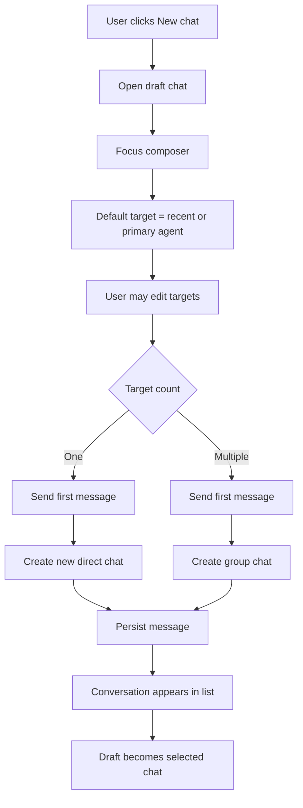

# Chat-First Workspace Product Design

## Status

Draft for discussion.

Related issues:

- agent-team-foundation/first-tree-all#99
- agent-team-foundation/first-tree-all#103

## Summary

First Tree Hub Workspace should move from an agent-centric roster to a chat-first collaboration surface.

The left rail contains conversations only. Agents and humans are selected from the composer through one lightweight target picker. A new chat is not configured in a modal and does not require a name. The user selects one or more targets, writes the first message, and the system creates the right chat:

- one target creates a new direct chat;
- multiple targets create a group chat;
- group titles are generated from participant names.

Chat mention notifications appear as red dots on conversation rows. System-level events stay in the notification bell.

## Product Model Decision

This design does not introduce a new standalone chat business entity. It uses the existing Hub chat model as the Workspace primary projection:

```text
Existing persistence
├─ chats
├─ messages
├─ chat_participants
└─ agent_chat_sessions
```

The change is which model drives Workspace navigation.

Current Workspace projection:

```text
Workspace left rail
→ agents
→ agent_chat_sessions
→ chat
```

Proposed Workspace projection:

```text
Workspace left rail
→ chats
→ participants / messages / read state
```

`agent_chat_sessions` remains important, but it is no longer the primary navigation model. Its responsibility is runtime state:

- whether an agent has an active, suspended, or evicted session in a chat;
- session-level activity and controls inside a selected chat;
- context-panel runtime details;
- runtime reconciliation between the server and client.

In short:

```text
Chat = conversation identity and user navigation identity
Agent session = runtime execution state inside a chat
```

Reasons:

- A group chat can involve multiple agents, and therefore multiple agent sessions. Using `agentId + chatId` as the main navigation key duplicates or fragments one conversation.
- A human can participate in a chat even when no agent session is currently active. The chat should still appear in Workspace.
- A new-chat draft exists before any backend chat or runtime session exists. Session-first navigation makes draft creation awkward.
- Future task chats should bind to chats, not to a single agent session.

Read state should be attached to chat membership, not to a separate Workspace-only table. The recommended implementation stores participant and watcher read state on `chat_participants`.

## Workspace Visibility Decision

Workspace should include both:

```text
A. Participant chats
   The current member's human agent is an active chat participant.

B. Watching chats
   One or more agents managed by the current member participate in the chat,
   but the member's human agent has not joined as a speaking participant.
```

This keeps Workspace useful as an agent-team operating surface: users see conversations they are actively participating in and conversations where their managed agents require attention.

However, the two states must be visually and behaviorally distinct:

```text
participant
→ can read
→ can reply
→ composer enabled
→ normal conversation row

watching
→ can read
→ cannot reply yet
→ composer replaced by "Join to reply"
→ row/header show Watching
```

Opening a watching chat must not implicitly add the human agent as a speaking participant. Joining is an explicit action because membership is a durable collaboration signal.

## Watch State Architecture Options

The product requirement above means Workspace cannot be limited to only chats where the user's human agent is already a participant. There are two viable storage designs for watching state.

### Option A: Separate Supervision Read State Table

Add a dedicated table for chats visible only through managed-agent supervision:

```text
chat_supervision_read_states
├─ member_id
├─ chat_id
├─ last_read_at
└─ unread_mention_count
```

Pros:

- Preserves a strict distinction between "participant" and "observer".
- Does not introduce non-speaking rows into `chat_participants`.
- Avoids touching message fan-out participant filtering.

Cons:

- Adds a second read-state model.
- `GET /me/chats` becomes a union of participant rows and supervision rows.
- Mark-read, unread counters, and migrations need two code paths.
- Reintroduces the extra table that the technical review explicitly recommends avoiding.

### Option B: Watcher Role In `chat_participants` (Recommended)

Use `chat_participants` as the single per-chat/per-agent state table, and add a watcher role:

```text
chat_participants
├─ chat_id
├─ agent_id
├─ role: owner | member | watcher
├─ mode: full | mention_only
├─ last_read_at
└─ unread_mention_count
```

Semantics:

- `owner` / `member`: speaking participants, can reply, included in message delivery.
- `watcher`: non-speaking observer, can read, appears in Workspace, has read/unread state, excluded from message delivery.
- `Join to reply`: upgrades the current member's human-agent row from `watcher` to `member` and sets `mode = "full"`.

Pros:

- No new table.
- Read state lives with the chat relationship that owns it.
- `/me/chats` can query one table: `chat_participants.agent_id = myHumanAgentId`.
- Participant and watcher rows share one counter/update path.
- Product semantics are explicit: watching is a weak chat relationship, not a hidden side table.

Cons:

- `chat_participants` now contains non-speaking rows.
- Message fan-out must explicitly exclude `role = "watcher"`.
- Existing code that assumes every `chat_participants` row is deliverable must be audited.

Recommendation:

Use Option B. It best balances product experience, query performance, and model simplicity. The implementation must document and test the invariant that `role = "watcher"` rows are never included in inbox fan-out.

Watcher-row creation should be write-maintained:

- When a chat is created or participants are added, identify managers of non-human participants.
- For each manager, resolve their human agent.
- If the human agent is not already a speaking participant, upsert a `watcher` row.
- A migration/backfill should create watcher rows for existing managed-agent chats.

## Problem

The current Workspace requires users to start from an agent row, then expand into sessions/chats. This makes agents the navigation primitive, even though the intended user job is to start or resume a conversation.

This creates several UX problems:

- Users must understand agent/session structure before they can act.
- Existing chats feel secondary to agent management.
- Group chat creation has no natural place in the workflow.
- Chat mentions compete with system notifications in the user's attention model.

## Goals

- Make conversation the primary navigation object in Workspace.
- Remove agent rows from the Workspace left rail.
- Let users start direct and group chats without a modal.
- Let users add chat members with the same picker pattern.
- Surface unread `@` mentions directly on conversation rows.
- Keep the notification bell for system-level events only.
- Leave room for future task chats without depending on the Task primitive.

## Non-Goals

- Implement the Task primitive.
- Build task board, task lifecycle, or task-specific chat filtering.
- Require group chat naming during creation.
- Build full IM administration controls such as mute, archive, kick, or role management.
- Replace Team or Settings pages for agent management.

## Product Principles

### Intent First

The main user action is expressing intent: "do this", "summarize this", "review this". The UI should not force users to configure a chat before they can write.

### One Composer

Direct chat, group chat, and future task chat should share the same composer interaction. The target selection determines the chat shape.

### No Modal By Default

Common chat creation should happen inline. Modal dialogs are reserved for future advanced settings, not first-run chat creation.

### Chat Is Navigation

The Workspace left rail navigates conversations. Agents and humans are collaborators selected inside the conversation workflow.

### Progressive Disclosure

Advanced agent management belongs in Team or Settings. Workspace exposes only the controls needed to start, resume, and steer collaboration.

## Information Architecture

```text
Workspace
├─ Conversation List
│  ├─ New chat
│  ├─ Direct chats
│  ├─ Group chats
│  └─ Future task chats
├─ Chat Surface
│  ├─ New chat draft
│  ├─ Selected chat
│  └─ Welcome suggestions
└─ Composer
   ├─ Target picker in draft chats
   ├─ Participants and add-member control in existing chats
   └─ Message input
```

## Primary Screen

```text
┌────────────────────────────────────────────────────────────────────┐
│ Workspace / Context / Team / Settings                    Bell User │
├──────────────────────┬─────────────────────────────────────────────┤
│ Conversations        │ New chat                                    │
│                      │                                             │
│ + New chat           │                                             │
│                      │             Hi, I'm code agent              │
│ ● Fix build error    │                Try asking                   │
│   Code Agent · 2m    │   [List my open tasks by priority]          │
│                      │   [Summarize what I did today]              │
│   Review layout      │   [Plan what to work on next]               │
│   Design + Gandy     │                                             │
│   18m ago            │                                             │
│                      │ ┌─────────────────────────────────────────┐ │
│   Plan next sprint   │ │ Tell code agent what to do...           │ │
│   Product Agent +2   │ │ To: code agent ▼                   Send │ │
│   1h ago             │ └─────────────────────────────────────────┘ │
└──────────────────────┴─────────────────────────────────────────────┘
```

## New Chat Flow



## Target Picker

The target picker is one reusable component. It supports both single-target and multi-target behavior without exposing separate modes to the user.

The picker is not a checkbox list. Clicking a row toggles selection. Selected rows use a check icon and selected chips.

```text
To: code agent ▼

┌────────────────────────────────────┐
│ [code agent ×] [design agent ×]    │
│ Search people or agents...         │
├────────────────────────────────────┤
│ ✓ code agent            agent      │
│ ✓ design agent          agent      │
│   product agent         agent      │
│   Gandy                 human      │
│   Liu Chao              human      │
└────────────────────────────────────┘
```

Rules:

- The draft chat always has at least one selected target.
- The default target is the most recently used agent. If there is no history, use the user's primary assistant.
- Selecting one target means a new direct chat.
- Selecting multiple targets means a new group chat.
- Pressing Enter toggles the highlighted row.
- Backspace removes the last selected chip when the search input is empty.
- Escape closes the picker.

Collapsed target display:

```text
To: code agent ▼
To: code agent +2 ▼
```

## Group Chat Creation

There is no "Create group chat" dialog.

A group chat is created when the user sends the first message with multiple selected targets.

```text
New chat
→ To: code agent, design agent, Gandy
→ "Please review the homepage copy and implementation"
→ Send
→ Create group chat
→ Persist message
→ Select created chat
```

Group title generation:

- Two participants: `Code Agent, Design Agent`
- Three participants: `Code Agent, Design Agent, Gandy`
- More than three participants: `Code Agent, Design Agent +2`

The generated title is display-only. A later inline rename feature can update `chat.topic`, but naming is not part of the creation flow.

## Existing Chat Member Add

Existing chats show participants in the header. A `+` button opens the same picker, filtered to people and agents not already in the chat.

```text
┌──────────────────────────────────────────────┐
│ Code Agent, Design Agent +1              +   │
├──────────────────────────────────────────────┤
│ messages...                                  │
└──────────────────────────────────────────────┘
```

Add-member picker:

```text
Add members

┌────────────────────────────────────┐
│ Search people or agents...         │
├────────────────────────────────────┤
│   product agent         agent      │
│   Gandy                 human      │
│   Liu Chao              human      │
└────────────────────────────────────┘
```

Behavior:

- Selecting a row immediately adds that participant.
- The UI updates optimistically.
- If the server rejects the add, the row is removed and an inline error appears.
- Adding someone to a direct chat upgrades the chat to a group behind the scenes. The UI simply becomes a multi-participant chat.
- Once a chat becomes `group`, it does not downgrade back to `direct` if members are later removed.
- Adding non-human participants may create watcher rows for their managers.

## Conversation List

The conversation list replaces the current agent roster.

```text
┌────────────────────────────┐
│ Conversations              │
│ + New chat                 │
├────────────────────────────┤
│ ● Fix homepage layout      │
│   Code Agent · 2m ago      │
├────────────────────────────┤
│   Review copied changes    │
│   Design, Gandy +2 · 18m   │
├────────────────────────────┤
│   Plan next sprint         │
│   Product Agent · Watching │
└────────────────────────────┘
```

Row hierarchy:

1. Unread `@` red dot.
2. Conversation title, not the primary agent name.
3. Collaborator metadata, including participants and `Watching` state.
4. Last-message preview when it is not already used as the title.
5. Updated time.
6. Optional badges, such as `group`, `offline`, and future `task`.

Title resolution:

1. `chat.topic` when present.
2. Otherwise the first-message or last-message generated title.
3. Otherwise participant summary as the fallback.

Agent names are metadata, not the row's primary title. This prevents the UI from becoming visually agent-first again.

## Unread Mentions

Chat mention notifications are row-level state, not notification-center state.

Unread mention definition:

- the message belongs to a chat visible to the current member;
- `messages.metadata.mentions` includes the current member's human agent id;
- or the message mentions an agent managed by the current member and the current member's human-agent row is `role = "watcher"`;
- the message was not sent by the current member's human agent.

Unread mention counters are maintained on write:

- increment `chat_participants.unread_mention_count` for mentioned speaking participants;
- increment watcher rows for managers whose managed agents were mentioned;
- do not increment the sender's row.

Opening a chat after the message list has loaded marks it read by setting `last_read_at = NOW()` and `unread_mention_count = 0` for the current member's human-agent row.

## Notification Model

```text
Conversation row red dot
├─ Unread @mentions in direct chats
└─ Unread @mentions in group chats

Notification bell
├─ agent_error
├─ agent_blocked
├─ agent_stale
├─ agent_disconnected
├─ agent_connected
├─ session_error
├─ session_completed
└─ computer / system / organization events
```

The notification bell should not show chat mention notifications. This keeps the bell reserved for system-level events and makes chat attention local to the chat list.

## Realtime Update Model

Chat-first Workspace needs a chat-level realtime signal. Existing admin WS invalidates notification and session queries, but it does not currently carry chat-message updates.

Add a best-effort `chat:message` frame:

```text
message persisted + inbox fan-out committed
→ projection fields updated
→ PG NOTIFY chat_message
→ admin WS sends chat:message to affected web clients
→ Web invalidates ["me", "chats"]
→ selected chat may append or refetch messages
```

Realtime delivery is an optimization. Failure must be logged and swallowed; durable message persistence and polling/refetch remain the correctness path.

## URL Model

Preferred route:

```text
/?c=<chatId>
```

Draft chat route:

```text
/
```

Legacy compatibility:

```text
/?a=<agentId>&c=<chatId>
```

The UI should stop requiring `agentId` to render a chat. Agent-specific context should be derived from chat participants and session state.

## API Design

New member-scoped chat APIs should live under `/me/*`, not `/admin/*`. `workspace` is a UI concept and should not appear in the API path.

```text
GET  /me/chats
POST /me/chats
POST /me/chats/:chatId/read
POST /me/chats/:chatId/participants
POST /me/chats/:chatId/join
```

Existing `/admin/chats/*` APIs stay in place for compatibility and are not part of this design's public surface.

### List Chats

```text
GET /me/chats
```

Response:

```ts
type MeChatRow = {
  chatId: string;
  type: "direct" | "group";
  membershipKind: "participant" | "watching";
  title: string;
  topic: string | null;
  participants: Array<{
    agentId: string;
    displayName: string;
    type: "human" | "personal_assistant" | "autonomous_agent";
  }>;
  participantCount: number;
  lastMessageAt: string | null;
  lastMessagePreview: string | null;
  unreadMentionCount: number;
  canReply: boolean;
  taskId: string | null;
  taskStatus: string | null;
};
```

Rules:

- Return rows where the current member's human agent has a `chat_participants` row.
- `role = "watcher"` maps to `membershipKind = "watching"` and `canReply = false`.
- `role = "owner" | "member"` maps to `membershipKind = "participant"` and `canReply = true`.
- Filter out thread rows in v1: `parent_chat_id IS NULL`.
- Task fields stay `null` until the Task primitive lands.

### Create Chat

```text
POST /me/chats
```

Body:

```ts
type CreateMeChatBody = {
  participantIds: string[];
  topic?: string | null;
};
```

Rules:

- The current member's human agent is automatically included as `role = "owner"`, `mode = "full"`.
- Always create a new chat. Do not dedupe direct chats or exact participant sets.
- One non-self participant creates `type = "direct"`.
- Two or more non-self participants create `type = "group"`.
- All participants must be visible and in the selected organization.
- Watcher rows are upserted for managers of non-human participants.

### Add Participants

```text
POST /me/chats/:chatId/participants
```

Body:

```ts
type AddParticipantsBody = {
  participantIds: string[];
};
```

Rules:

- Existing speaking participants are returned as no-ops.
- Adding to a direct chat upgrades it to `type = "group"` when participant count reaches 3.
- `type = "group"` never downgrades back to direct.
- Server enforces visibility and organization boundaries.
- Watcher rows are upserted for managers of newly added non-human participants.

### Mark Chat Read

```text
POST /me/chats/:chatId/read
```

Marks the current member's human-agent participant or watcher row read:

```text
last_read_at = NOW()
unread_mention_count = 0
```

### Join To Reply

```text
POST /me/chats/:chatId/join
```

If the current member's human agent has a watcher row, upgrade it:

```text
role = "member"
mode = "full"
```

If no row exists but access is allowed, insert a member row. After join, the chat behaves like a normal participant chat and the composer is enabled.

## Data Model

Extend `chat_participants` instead of adding a separate read-state table:

```text
chat_participants
├─ role text not null default 'member'
├─ mode text not null default 'full'
├─ last_read_at timestamptz
└─ unread_mention_count int not null default 0
```

Role semantics:

```text
owner   = speaking participant with ownership semantics
member  = speaking participant
watcher = non-speaking observer, excluded from inbox fan-out
```

`mode` remains the existing delivery mode for speaking participants:

```text
full
mention_only
```

Add chat-list projection fields to `chats`:

```text
chats
├─ last_message_at timestamptz
└─ last_message_preview text
```

Recommended index:

```text
idx_chats_org_last_message(organization_id, last_message_at DESC)
```

Write-side projection updates:

- after message persistence and inbox fan-out complete, in the same transaction, update `chats.last_message_at`, `chats.last_message_preview`, and `chats.updated_at`;
- increment unread counters for mentioned speaking participants and relevant watcher rows;
- keep the update as an append-only projection step after the existing fan-out logic.

Backfill:

```sql
UPDATE chats c SET
  last_message_at = (SELECT MAX(created_at) FROM messages WHERE chat_id = c.id),
  last_message_preview = (
    SELECT LEFT(content::text, 200)
    FROM messages
    WHERE chat_id = c.id
    ORDER BY created_at DESC
    LIMIT 1
  );
```

For `unread_mention_count`, default existing rows to `0`. Product accepts that after migration, historical chats start as read for Workspace row-dot purposes.

## Client SDK Impact

SDK changes are not on the critical path for the chat-first Workspace rollout.

This design's implementation scope is Web UI plus member-facing server APIs. Agent-runtime SDK helpers such as `createChat`, `addChatParticipant`, and `removeChatParticipant` should be handled in a separate PR so this work does not expand into the agent data plane.

## Web Components

New or changed components:

- `ConversationList`
- `ConversationRow`
- `NewChatDraft`
- `TargetPicker`
- `ParticipantsHeader`
- `AddMembersPicker`

Retired from Workspace:

- `AgentRoster` as the primary left rail
- Agent-first `?a=` selection as a rendering requirement

## Empty, Loading, and Error States

### Empty Conversation List

```text
No conversations yet
Start with New chat
```

### Draft Without Network

The message stays in the composer if creation fails. The user can retry.

### Offline Target

Offline agents remain selectable. The composer shows:

```text
code agent is offline — your message will queue
```

### Permission Failure

If a selected target becomes unavailable, remove that target from the draft and show:

```text
Some targets are no longer available.
```

The typed message is preserved.

## Accessibility

- Target picker rows must be keyboard navigable.
- Selection state must be exposed with `aria-selected`.
- The picker trigger must describe the current selected targets.
- Red-dot unread state must not be color-only; row should expose an accessible label such as `1 unread mention`.
- Send button must remain reachable by keyboard.
- Focus returns to the composer after target selection.

## Implementation Plan

Recommended PR split:

1. Backend foundation:
   - migration for `chat_participants.role`, `last_read_at`, `unread_mention_count`;
   - migration for `chats.last_message_at`, `last_message_preview`;
   - watcher-row backfill for managed-agent chats;
   - `GET /me/chats`;
   - `POST /me/chats`;
   - `POST /me/chats/:chatId/read`;
   - `POST /me/chats/:chatId/participants`;
   - `POST /me/chats/:chatId/join`;
   - service tests.
2. Realtime projection:
   - message-list projection update after message persistence and fan-out;
   - `chat:message` notification through PG notify and admin WS;
   - Web query invalidation contract for `["me", "chats"]`;
   - failure must log and swallow.
3. Web UI:
   - replace Workspace `AgentRoster` with `ConversationList`;
   - add `NewChatDraft` and `TargetPicker`;
   - add `ParticipantsHeader` and `Join to reply`;
   - support legacy `?a=&c=` by redirecting or deriving `chatId` state;
   - keep notification bell for system events only.
4. SDK follow-up:
   - add agent-side chat helper methods in a separate PR.

Risk constraints:

1. Do not rewrite `services/message.ts`, `services/inbox.ts`, or message-dispatcher payload assembly.
2. Projection updates are appended after existing message persistence and fan-out, and are tested independently.
3. Watcher rows must never receive inbox entries.
4. Do not reuse inbox `acked` status as Web read state.
5. Do not piggyback read-state writes into `sendMessage`; mark-read remains a member action.

## Acceptance Criteria

- Workspace left rail contains conversations only.
- Agent rows are not shown in Workspace.
- Clicking New chat opens an inline draft and focuses the composer.
- The default target is selected automatically.
- Sending to one target creates a new direct chat.
- Sending to multiple targets creates a group chat.
- Group chat creation does not open a dialog and does not require a name.
- Existing chats can add members without a dialog.
- Watching chats are visible in the list with a clear `Watching` state.
- Opening a watching chat does not auto-join the current user.
- `Join to reply` upgrades the watcher row to a speaking member row.
- Conversation rows show unread `@` red dots.
- Opening a chat clears that chat's unread mention state.
- Notification bell does not show chat mention notifications.
- Task fields are present in the API shape but `null` until Task primitive support lands.

## Open Questions

- What is the authoritative source for the user's primary assistant?
- Should mark-read happen immediately after the message list loads, or only after the user scrolls to the bottom? Recommendation for v1: after message-list load.
- Should system notifications that reference a chat navigate to `/?c=<chatId>` even though mention notifications stay out of the bell? Recommendation: yes.

Resolved decisions:

- Direct chat creation does not dedupe; every New Chat send creates a new direct chat.
- Group chat creation does not dedupe exact participant sets.
- Thread chats do not appear in the Workspace conversation list in v1.
- SDK helpers are a separate follow-up PR.
- Recommended watch-state storage is `chat_participants.role = "watcher"`, not a separate read-state table.

## Context Tree Impact

This design changes the Workspace product model from agent-first to chat-first and changes the relationship between chat notifications and system notifications.

If adopted, update the Context Tree for Agent Hub / Web Console before or alongside the implementation PR.
