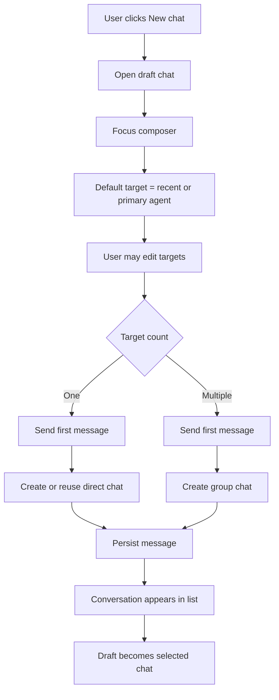

# Chat-First Workspace Product Design

## Status

Draft for discussion.

Related issues:

- agent-team-foundation/first-tree-all#99
- agent-team-foundation/first-tree-all#103

## Summary

First Tree Hub Workspace should move from an agent-centric roster to a chat-first collaboration surface.

The left rail contains conversations only. Agents and humans are selected from the composer through one lightweight target picker. A new chat is not configured in a modal and does not require a name. The user selects one or more targets, writes the first message, and the system creates or reuses the right chat:

- one target creates or reuses a direct chat;
- multiple targets create a group chat;
- group titles are generated from participant names.

Chat mention notifications appear as red dots on conversation rows. System-level events stay in the notification bell.

## Product Model Decision

This design does not introduce a new standalone chat business entity. It uses the existing Hub chat model as the Workspace primary projection:

```text
Existing persistence
├─ chats
├─ messages
├─ chat_participants
└─ agent_chat_sessions
```

The change is which model drives Workspace navigation.

Current Workspace projection:

```text
Workspace left rail
→ agents
→ agent_chat_sessions
→ chat
```

Proposed Workspace projection:

```text
Workspace left rail
→ chats
→ participants / messages / read state
```

`agent_chat_sessions` remains important, but it is no longer the primary navigation model. Its responsibility is runtime state:

- whether an agent has an active, suspended, or evicted session in a chat;
- session-level activity and controls inside a selected chat;
- context-panel runtime details;
- runtime reconciliation between the server and client.

In short:

```text
Chat = conversation identity and user navigation identity
Agent session = runtime execution state inside a chat
```

Reasons:

- A group chat can involve multiple agents, and therefore multiple agent sessions. Using `agentId + chatId` as the main navigation key duplicates or fragments one conversation.
- A human can participate in a chat even when no agent session is currently active. The chat should still appear in Workspace.
- A new-chat draft exists before any backend chat or runtime session exists. Session-first navigation makes draft creation awkward.
- Future task chats should bind to chats, not to a single agent session.

The only new persistence required by this design is member-scoped read state for unread mention dots.

## Problem

The current Workspace requires users to start from an agent row, then expand into sessions/chats. This makes agents the navigation primitive, even though the intended user job is to start or resume a conversation.

This creates several UX problems:

- Users must understand agent/session structure before they can act.
- Existing chats feel secondary to agent management.
- Group chat creation has no natural place in the workflow.
- Chat mentions compete with system notifications in the user's attention model.

## Goals

- Make conversation the primary navigation object in Workspace.
- Remove agent rows from the Workspace left rail.
- Let users start direct and group chats without a modal.
- Let users add chat members with the same picker pattern.
- Surface unread `@` mentions directly on conversation rows.
- Keep the notification bell for system-level events only.
- Leave room for future task chats without depending on the Task primitive.

## Non-Goals

- Implement the Task primitive.
- Build task board, task lifecycle, or task-specific chat filtering.
- Require group chat naming during creation.
- Build full IM administration controls such as mute, archive, kick, or role management.
- Replace Team or Settings pages for agent management.

## Product Principles

### Intent First

The main user action is expressing intent: "do this", "summarize this", "review this". The UI should not force users to configure a chat before they can write.

### One Composer

Direct chat, group chat, and future task chat should share the same composer interaction. The target selection determines the chat shape.

### No Modal By Default

Common chat creation should happen inline. Modal dialogs are reserved for future advanced settings, not first-run chat creation.

### Chat Is Navigation

The Workspace left rail navigates conversations. Agents and humans are collaborators selected inside the conversation workflow.

### Progressive Disclosure

Advanced agent management belongs in Team or Settings. Workspace exposes only the controls needed to start, resume, and steer collaboration.

## Information Architecture

```text
Workspace
├─ Conversation List
│  ├─ New chat
│  ├─ Direct chats
│  ├─ Group chats
│  └─ Future task chats
├─ Chat Surface
│  ├─ New chat draft
│  ├─ Selected chat
│  └─ Welcome suggestions
└─ Composer
   ├─ Target picker in draft chats
   ├─ Participants and add-member control in existing chats
   └─ Message input
```

## Primary Screen

```text
┌────────────────────────────────────────────────────────────────────┐
│ Workspace / Context / Team / Settings                    Bell User │
├──────────────────────┬─────────────────────────────────────────────┤
│ Conversations        │ New chat                                    │
│                      │                                             │
│ + New chat           │                                             │
│                      │             Hi, I'm code agent              │
│ ● Code Agent         │                Try asking                   │
│   Fix build error    │                                             │
│   2m ago             │   [List my open tasks by priority]          │
│                      │   [Summarize what I did today]              │
│   Design + Gandy     │   [Plan what to work on next]               │
│   Review layout      │                                             │
│   18m ago            │                                             │
│                      │ ┌─────────────────────────────────────────┐ │
│   Product +2         │ │ Tell code agent what to do...           │ │
│   Plan next sprint   │ │ To: code agent ▼                   Send │ │
│   1h ago             │ └─────────────────────────────────────────┘ │
└──────────────────────┴─────────────────────────────────────────────┘
```

## New Chat Flow



## Target Picker

The target picker is one reusable component. It supports both single-target and multi-target behavior without exposing separate modes to the user.

The picker is not a checkbox list. Clicking a row toggles selection. Selected rows use a check icon and selected chips.

```text
To: code agent ▼

┌────────────────────────────────────┐
│ [code agent ×] [design agent ×]    │
│ Search people or agents...         │
├────────────────────────────────────┤
│ ✓ code agent            agent      │
│ ✓ design agent          agent      │
│   product agent         agent      │
│   Gandy                 human      │
│   Liu Chao              human      │
└────────────────────────────────────┘
```

Rules:

- The draft chat always has at least one selected target.
- The default target is the most recently used agent. If there is no history, use the user's primary assistant.
- Selecting one target means direct chat.
- Selecting multiple targets means group chat.
- Pressing Enter toggles the highlighted row.
- Backspace removes the last selected chip when the search input is empty.
- Escape closes the picker.

Collapsed target display:

```text
To: code agent ▼
To: code agent +2 ▼
```

## Group Chat Creation

There is no "Create group chat" dialog.

A group chat is created when the user sends the first message with multiple selected targets.

```text
New chat
→ To: code agent, design agent, Gandy
→ "Please review the homepage copy and implementation"
→ Send
→ Create group chat
→ Persist message
→ Select created chat
```

Group title generation:

- Two participants: `Code Agent, Design Agent`
- Three participants: `Code Agent, Design Agent, Gandy`
- More than three participants: `Code Agent, Design Agent +2`

The generated title is display-only. A later inline rename feature can update `chat.topic`, but naming is not part of the creation flow.

## Existing Chat Member Add

Existing chats show participants in the header. A `+` button opens the same picker, filtered to people and agents not already in the chat.

```text
┌──────────────────────────────────────────────┐
│ Code Agent, Design Agent +1              +   │
├──────────────────────────────────────────────┤
│ messages...                                  │
└──────────────────────────────────────────────┘
```

Add-member picker:

```text
Add members

┌────────────────────────────────────┐
│ Search people or agents...         │
├────────────────────────────────────┤
│   product agent         agent      │
│   Gandy                 human      │
│   Liu Chao              human      │
└────────────────────────────────────┘
```

Behavior:

- Selecting a row immediately adds that participant.
- The UI updates optimistically.
- If the server rejects the add, the row is removed and an inline error appears.
- Adding someone to a direct chat upgrades the chat to a group behind the scenes. The UI simply becomes a multi-participant chat.

## Conversation List

The conversation list replaces the current agent roster.

```text
┌────────────────────────────┐
│ Conversations              │
│ + New chat                 │
├────────────────────────────┤
│ ● Code Agent               │
│   Fix homepage layout      │
│   2m ago                   │
├────────────────────────────┤
│   Design Agent, Gandy +2   │
│   Review copied changes    │
│   18m ago                  │
├────────────────────────────┤
│   Product Agent            │
│   Plan next sprint         │
│   1h ago                   │
└────────────────────────────┘
```

Row hierarchy:

1. Unread `@` red dot.
2. Conversation title.
3. Last message preview.
4. Updated time.
5. Optional badges, such as `group`, `offline`, and future `task`.

## Unread Mentions

Chat mention notifications are row-level state, not notification-center state.

Unread mention definition:

- the message belongs to a chat visible to the current member;
- `messages.metadata.mentions` includes the current member's human agent id;
- `messages.createdAt` is newer than the member's read state for that chat;
- the message was not sent by the current member's human agent.

Opening a chat marks it read.

## Notification Model

```text
Conversation row red dot
├─ Unread @mentions in direct chats
└─ Unread @mentions in group chats

Notification bell
├─ agent_error
├─ agent_blocked
├─ agent_stale
├─ agent_disconnected
├─ agent_connected
├─ session_error
├─ session_completed
└─ computer / system / organization events
```

The notification bell should not show chat mention notifications. This keeps the bell reserved for system-level events and makes chat attention local to the chat list.

## URL Model

Preferred route:

```text
/?c=<chatId>
```

Draft chat route:

```text
/
```

Legacy compatibility:

```text
/?a=<agentId>&c=<chatId>
```

The UI should stop requiring `agentId` to render a chat. Agent-specific context should be derived from chat participants and session state.

## API Design

### List Workspace Chats

```text
GET /admin/chats/workspace
```

Response:

```ts
type WorkspaceChatRow = {
  chatId: string;
  type: "direct" | "group" | "thread";
  title: string;
  topic: string | null;
  participants: Array<{
    agentId: string;
    displayName: string;
    type: "human" | "personal_assistant" | "autonomous_agent";
  }>;
  participantCount: number;
  lastMessagePreview: string | null;
  unreadMentionCount: number;
  updatedAt: string;
  taskId: string | null;
  taskStatus: string | null;
};
```

Task fields stay `null` until the Task primitive lands.

### Create Chat

```text
POST /admin/chats
```

Body:

```ts
type CreateAdminChatBody = {
  participantIds: string[];
  topic?: string | null;
};
```

Rules:

- The current member's human agent is automatically included.
- One non-self participant creates or reuses a direct chat where possible.
- Multiple participants create a group chat.
- All participants must be visible and in the selected organization.

### Add Participants

```text
POST /admin/chats/:chatId/participants
```

Body:

```ts
type AddParticipantsBody = {
  participantIds: string[];
};
```

Rules:

- Adding to a direct chat upgrades it to group when needed.
- Existing participants are ignored or returned as no-ops.
- Server enforces visibility and organization boundaries.

### Mark Chat Read

```text
POST /admin/chats/:chatId/read
```

Marks the chat read for the current member.

## Data Model

Add member-scoped read state:

```text
chat_read_states
├─ member_id text not null
├─ chat_id text not null
├─ last_read_at timestamptz not null
├─ updated_at timestamptz not null
└─ unique(member_id, chat_id)
```

Indexes:

```text
idx_chat_read_states_member_chat(member_id, chat_id)
```

Unread mention count can be derived by joining visible chats, messages, and read state.

## Client SDK Impact

Expose existing agent chat capabilities in the SDK:

```ts
createChat(data: CreateChat): Promise<ChatDetail>
addChatParticipant(chatId: string, agentId: string): Promise<ChatParticipant[]>
removeChatParticipant(chatId: string, agentId: string): Promise<void>
```

The server already exposes agent-side create and participant APIs. The SDK should make them first-class.

## Web Components

New or changed components:

- `ConversationList`
- `ConversationRow`
- `NewChatDraft`
- `TargetPicker`
- `ParticipantsHeader`
- `AddMembersPicker`

Retired from Workspace:

- `AgentRoster` as the primary left rail
- Agent-first `?a=` selection as a rendering requirement

## Empty, Loading, and Error States

### Empty Conversation List

```text
No conversations yet
Start with New chat
```

### Draft Without Network

The message stays in the composer if creation fails. The user can retry.

### Offline Target

Offline agents remain selectable. The composer shows:

```text
code agent is offline — your message will queue
```

### Permission Failure

If a selected target becomes unavailable, remove that target from the draft and show:

```text
Some targets are no longer available.
```

The typed message is preserved.

## Accessibility

- Target picker rows must be keyboard navigable.
- Selection state must be exposed with `aria-selected`.
- The picker trigger must describe the current selected targets.
- Red-dot unread state must not be color-only; row should expose an accessible label such as `1 unread mention`.
- Send button must remain reachable by keyboard.
- Focus returns to the composer after target selection.

## Implementation Plan

1. Add `chat_read_states` schema and migration.
2. Add `GET /admin/chats/workspace`.
3. Add `POST /admin/chats`.
4. Add multi-add participant endpoint for admin web.
5. Add mark-read endpoint.
6. Add SDK create/add/remove chat participant methods.
7. Replace Workspace `AgentRoster` with `ConversationList`.
8. Add `NewChatDraft` and `TargetPicker`.
9. Update `ChatView` and `ContextPanel` to work from `chatId` as the primary route state.
10. Keep notification bell for system events only.
11. Add server tests and web type checks.

## Acceptance Criteria

- Workspace left rail contains conversations only.
- Agent rows are not shown in Workspace.
- Clicking New chat opens an inline draft and focuses the composer.
- The default target is selected automatically.
- Sending to one target creates or reuses a direct chat.
- Sending to multiple targets creates a group chat.
- Group chat creation does not open a dialog and does not require a name.
- Existing chats can add members without a dialog.
- Conversation rows show unread `@` red dots.
- Opening a chat clears that chat's unread mention state.
- Notification bell does not show chat mention notifications.
- Task fields are present in the API shape but `null` until Task primitive support lands.

## Open Questions

- What is the authoritative source for the user's primary assistant?
- Should direct chat creation always reuse an existing direct chat, or allow multiple direct chats with the same target?
- Should group chat creation dedupe exact participant sets, or always create a fresh group chat?
- Should mark-read happen on chat open, after the message list loads, or after the user scrolls to the bottom?
- Should system notifications that reference a chat navigate to `/?c=<chatId>` even though mention notifications stay out of the bell?

## Context Tree Impact

This design changes the Workspace product model from agent-first to chat-first and changes the relationship between chat notifications and system notifications.

If adopted, update the Context Tree for Agent Hub / Web Console before or alongside the implementation PR.
