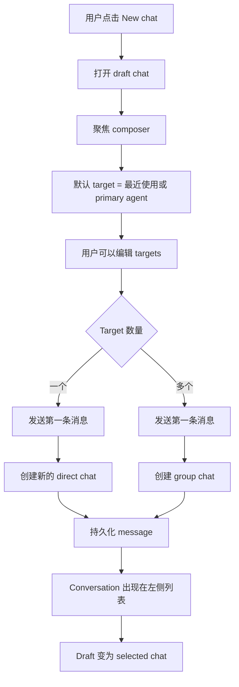

# Chat-First Workspace 产品设计

## 状态

讨论草案。

相关 issue：

- agent-team-foundation/first-tree-all#99
- agent-team-foundation/first-tree-all#103

## 摘要

First Tree Hub Workspace 应从以 agent roster 为中心，转向以 chat/conversation 为中心的协作界面。

左侧只展示 conversations。Agents 和 humans 不再作为 Workspace 左侧导航项，而是在 composer 里的轻量 target picker 中选择。新建聊天不弹出对话框，也不要求用户命名。用户选择一个或多个目标，输入第一条消息并发送，系统根据目标数量创建合适的 chat：

- 一个目标：创建新的 direct chat；
- 多个目标：创建 group chat；
- group title 根据参与者名称自动生成。

Chat mention 通知显示为 conversation row 上的红点。系统级事件继续留在 notification bell 中。

## 产品模型决策

本设计不引入一套新的独立 chat 业务实体。Workspace 使用 Hub 现有的 chat 模型作为主投影：

```text
Existing persistence
├─ chats
├─ messages
├─ chat_participants
└─ agent_chat_sessions
```

变化点不是新增 chat 模型，而是改变 Workspace 导航由哪个模型驱动。

当前 Workspace 投影：

```text
Workspace left rail
→ agents
→ agent_chat_sessions
→ chat
```

建议后的 Workspace 投影：

```text
Workspace left rail
→ chats
→ participants / messages / read state
```

`agent_chat_sessions` 仍然重要，但它不再是 Workspace 的主导航模型。它的职责调整为 runtime state：

- 某个 agent 在某个 chat 中是否有 active、suspended 或 evicted session；
- 选中 chat 内的 session-level activity 和 controls；
- context panel 中的 runtime details；
- server 与 client 之间的 runtime reconciliation。

简化理解：

```text
Chat = conversation identity and user navigation identity
Agent session = runtime execution state inside a chat
```

原因：

- 一个 group chat 可能包含多个 agents，因此会有多个 agent sessions。如果继续用 `agentId + chatId` 作为主导航 key，同一个 conversation 会被重复展示或被割裂。
- human 可以参与一个 chat，即使当前没有任何 agent session active，这个 chat 也应该出现在 Workspace。
- new-chat draft 在发送第一条消息前还没有 backend chat，更没有 runtime session。session-first 导航会让 draft creation 变得别扭。
- 未来 task chats 应该绑定到 chats，而不是绑定到某个单一 agent session。

Read state 应附着在 chat membership 上，而不是放在一张 Workspace-only 的独立表中。推荐实现是在 `chat_participants` 中保存 participant 和 watcher 的 read state。

## Workspace 可见性决策

Workspace 应同时包含：

```text
A. Participant chats
   当前 member 的 human agent 是 active chat participant。

B. Watching chats
   当前 member 管理的一个或多个 agents 参与了该 chat，
   但 member 的 human agent 尚未作为 speaking participant 加入。
```

这让 Workspace 能成为 agent team 的工作入口：用户既能看到自己正在参与的 conversations，也能看到自己管理的 agents 需要关注的 conversations。

但这两种状态必须在视觉和行为上明确区分：

```text
participant
→ 可读
→ 可回复
→ composer enabled
→ 普通 conversation row

watching
→ 可读
→ 暂不可回复
→ composer 替换为 "Join to reply"
→ row/header 显示 Watching
```

打开 watching chat 不能隐式把 human agent 加为 speaking participant。Join 是一个明确动作，因为 membership 是一个持久协作信号。

## Watch State 架构方案

上面的产品要求意味着 Workspace 不能只展示用户 human agent 已参与的 chats。Watching state 有两个可行的存储方案。

### 方案 A：独立 Supervision Read State 表

为 supervision-only chats 增加专门 read state 表：

```text
chat_supervision_read_states
├─ member_id
├─ chat_id
├─ last_read_at
└─ unread_mention_count
```

优点：

- 严格区分“参与者”和“观察者”。
- 不向 `chat_participants` 引入 non-speaking rows。
- 不需要调整 message fan-out 的 participant 过滤。

缺点：

- 引入第二套 read-state model。
- `GET /me/chats` 需要 union participant rows 和 supervision rows。
- Mark-read、unread counters 和 migrations 需要两条路径。
- 重新引入专家评估建议避免的额外 read-state 表。

### 方案 B：在 `chat_participants` 中增加 Watcher Role（推荐）

把 `chat_participants` 作为唯一 per-chat/per-agent state 表，增加 watcher role：

```text
chat_participants
├─ chat_id
├─ agent_id
├─ role: owner | member | watcher
├─ mode: full | mention_only
├─ last_read_at
└─ unread_mention_count
```

语义：

- `owner` / `member`：speaking participants，可回复，参与消息投递。
- `watcher`：non-speaking observer，可阅读，出现在 Workspace，有 read/unread state，不参与消息投递。
- `Join to reply`：把当前 member 的 human-agent row 从 `watcher` 升级为 `member`，并设置 `mode = "full"`。

优点：

- 不新增表。
- Read state 与拥有它的 chat relationship 放在一起。
- `/me/chats` 只需要查一张表：`chat_participants.agent_id = myHumanAgentId`。
- Participant 和 watcher rows 共享同一套 counter/update 路径。
- 产品语义明确：watching 是一种弱 chat relationship，不是隐藏在旁边表里的状态。

缺点：

- `chat_participants` 会包含 non-speaking rows。
- Message fan-out 必须明确排除 `role = "watcher"`。
- 现有假设每个 `chat_participants` row 都可投递的代码需要 audit。

推荐：

采用方案 B。它在产品体验、查询性能和模型简洁性之间最平衡。实现必须文档化并测试这个不变量：`role = "watcher"` rows 永远不进入 inbox fan-out。

Watcher row 应在写入时维护：

- 当 chat 创建或新增 participants 时，识别 non-human participants 的 managers。
- 对每个 manager，解析其 human agent。
- 如果该 human agent 还不是 speaking participant，则 upsert 一个 `watcher` row。
- 迁移/backfill 应为既有 managed-agent chats 创建 watcher rows。

## 问题

当前 Workspace 要求用户先从 agent row 开始，再展开到 sessions/chats。这让 agents 成为导航原语，但用户真正想做的是开始或继续一段 conversation。

这带来几个 UX 问题：

- 用户在行动前必须理解 agent/session 结构。
- 现有 chats 像是 agent 管理下的二级内容，而不是主要工作对象。
- group chat 创建没有自然的入口。
- chat mention 和 system notification 混在一起，会干扰用户注意力模型。

## 目标

- 让 conversation 成为 Workspace 的主要导航对象。
- 从 Workspace 左侧移除 agent rows。
- 用户可以不通过 modal 创建 direct chat 和 group chat。
- 用户可以用同一套 picker 交互给已有 chat 加成员。
- unread `@` mentions 直接显示在 conversation rows 上。
- notification bell 只保留 system-level events。
- 为未来 task chats 预留空间，但不依赖 Task primitive。

## 非目标

- 不实现 Task primitive。
- 不实现 task board、task lifecycle 或 task-specific chat filtering。
- 不要求用户在创建 group chat 时命名。
- 不实现完整 IM 管理能力，例如 mute、archive、kick 或 role management。
- 不替代 Team 或 Settings 页面里的 agent 管理能力。

## 产品原则

### Intent First

用户的主动作是表达意图：“做这个”、“总结这个”、“review 这个”。UI 不应该强迫用户先配置 chat，才能开始写消息。

### One Composer

Direct chat、group chat 和未来 task chat 应共享同一个 composer 交互。Target selection 决定 chat shape。

### No Modal By Default

常规 chat creation 应该 inline 发生。Modal dialogs 只用于未来高级设置，不用于第一步 chat creation。

### Chat Is Navigation

Workspace 左侧只导航 conversations。Agents 和 humans 是 conversation workflow 中被选择的协作者。

### Progressive Disclosure

高级 agent 管理属于 Team 或 Settings。Workspace 只暴露开始、恢复和推进协作所需的控制。

## 信息架构

```text
Workspace
├─ Conversation List
│  ├─ New chat
│  ├─ Direct chats
│  ├─ Group chats
│  └─ Future task chats
├─ Chat Surface
│  ├─ New chat draft
│  ├─ Selected chat
│  └─ Welcome suggestions
└─ Composer
   ├─ Target picker in draft chats
   ├─ Participants and add-member control in existing chats
   └─ Message input
```

## 主界面

```text
┌────────────────────────────────────────────────────────────────────┐
│ Workspace / Context / Team / Settings                    Bell User │
├──────────────────────┬─────────────────────────────────────────────┤
│ Conversations        │ New chat                                    │
│                      │                                             │
│ + New chat           │                                             │
│                      │             Hi, I'm code agent              │
│ ● Fix build error    │                Try asking                   │
│   Code Agent · 2m    │   [List my open tasks by priority]          │
│                      │   [Summarize what I did today]              │
│   Review layout      │   [Plan what to work on next]               │
│   Design + Gandy     │                                             │
│   18m ago            │                                             │
│                      │ ┌─────────────────────────────────────────┐ │
│   Plan next sprint   │ │ Tell code agent what to do...           │ │
│   Product Agent +2   │ │ To: code agent ▼                   Send │ │
│   1h ago             │ └─────────────────────────────────────────┘ │
└──────────────────────┴─────────────────────────────────────────────┘
```

## UI 设计细节

UI 应复用当前 session chat 中间聊天区的成熟结构，但信息层级必须从 session-first 改成 conversation-first。

推荐布局：

```text
┌──────────────────────────┬──────────────────────────────────────────┬────────────────────────┐
│ Conversation List        │ Chat Surface                             │ Context Panel           │
│                          │                                          │                        │
│ conversations inbox      │ header                                   │ participants           │
│ search + filters         │ timeline                                 │ agent/session runtime   │
│ selected chat row        │ composer                                 │ debug/details/actions   │
└──────────────────────────┴──────────────────────────────────────────┴────────────────────────┘
```

### Conversation List UI

左侧是轻量 conversation inbox，不应该像当前 agent/session tree。

```text
┌────────────────────────────────┐
│ Conversations              +   │
│ Search chats...                │
│ [All] [Unread] [Watching]      │
├────────────────────────────────┤
│ ● Fix homepage layout      2m  │
│   Code Agent · Check CSS...    │
├────────────────────────────────┤
│   Review copied changes   18m  │
│   Design, Gandy +2             │
├────────────────────────────────┤
│   Plan next sprint        1h   │
│   Product Agent · Watching     │
└────────────────────────────────┘
```

Row anatomy：

```text
unread dot  title                              last activity time
            participants/status · preview
```

规则：

- 默认 row height 应保持紧凑，约 `56-64px`。
- 第一行始终是 conversation title 和 last activity time。
- 第二行是辅助信息：participants summary、`Watching`、operational status 或短 preview。
- 时间表示 last activity time，不是加入时间或创建时间。
- Participant names 是 metadata，不能成为主标题。
- Row 内不展示 chat id、session count、加入时间或完整 participant list。
- 选中 row 使用轻量 active background 和左侧 accent border。
- Unread mention row 使用红点和更强的 title weight；不能只依赖颜色。

v1 filters：

- `All`
- `Unread`
- `Watching`

不要按 `Direct`、`Group`、`Agent` 或 `Human` 拆主列表。用户主要按最近活动和注意力扫描，而不是按 chat 类型找内容。

### Chat Surface UI

中间区域应保留当前 session chat 的结构：

```text
┌────────────────────────────────────────────────────────────┐
│ Fix homepage layout                         +  more        │
│ Code Agent, Design Agent, Gandy · 2 active agents           │
├────────────────────────────────────────────────────────────┤
│ timeline                                                    │
│                                                            │
│ Gandy        10:24                                          │
│ Please review the homepage layout                          │
│                                                            │
│ Code Agent   10:25                                          │
│ thinking...                                                 │
│ using read_file(...)                                        │
│                                                            │
│ Code Agent   10:26                                          │
│ The layout issue is in ...                                  │
├────────────────────────────────────────────────────────────┤
│ Message this chat...                         attach  Send  │
└────────────────────────────────────────────────────────────┘
```

从当前 session chat 复用：

- header、timeline、bottom composer 结构；
- sender/avatar/time/message rows；
- 轻量 `thinking`、`using tool`、streaming assistant text 和 error rows；
- attachment、mention autocomplete、keyboard send 和 inline send errors；
- `chat.topic` 的 inline rename。

需要调整：

- Header title 是 conversation title，不是 primary agent name。
- Header subtitle 是 participants 和 high-level activity，不是 debug/session facts。
- Runtime state、session count、完整 chat id、suspend 和 terminate controls 下沉到 context panel 或 overflow menu。
- Route 应基于 `chatId` 渲染；需要 agent 信息时，从 participants 和 active sessions 推导。
- 完成后的 tool/session details 应保持折叠，让 timeline 是协作界面，而不是日志查看器。

### Watching Chat UI

Watching chats 可读，但用户明确 join 之前不可直接回复。

```text
┌────────────────────────────────────────────────────────────┐
│ Plan next sprint                            Watching       │
│ Product Agent · You are watching because you manage it      │
├────────────────────────────────────────────────────────────┤
│ timeline                                                    │
├────────────────────────────────────────────────────────────┤
│ [ Join to reply ]                                           │
└────────────────────────────────────────────────────────────┘
```

规则：

- 打开 watching chat 不能自动 join。
- Composer 替换为单一 `Join to reply` action。
- `Join to reply` 将 watcher row 升级为 speaking member row。
- Watching 是中性状态，不是 error state。

## New Chat 流程



## Target Picker

Target picker 是一个可复用组件。它同时支持 single-target 和 multi-target 行为，但不把模式暴露给用户。

Picker 不是 checkbox list。点击 row 即切换选择状态。选中状态用 check icon 和 selected chips 表达。

```text
To: code agent ▼

┌────────────────────────────────────┐
│ [code agent ×] [design agent ×]    │
│ Search people or agents...         │
├────────────────────────────────────┤
│ ✓ code agent            agent      │
│ ✓ design agent          agent      │
│   product agent         agent      │
│   Gandy                 human      │
│   Liu Chao              human      │
└────────────────────────────────────┘
```

规则：

- Draft chat 始终至少有一个 selected target。
- 默认 target 是最近使用的 agent。如果没有历史记录，则使用用户的 primary assistant。
- 选择一个 target 表示新的 direct chat。
- 选择多个 targets 表示新的 group chat。
- Enter 切换当前高亮 row 的选择状态。
- 当 search input 为空时，Backspace 删除最后一个 selected chip。
- Escape 关闭 picker。

Collapsed target display：

```text
To: code agent ▼
To: code agent +2 ▼
```

## Group Chat 创建

没有 “Create group chat” dialog。

用户在多选 targets 后发送第一条消息，即创建 group chat。

```text
New chat
→ To: code agent, design agent, Gandy
→ "Please review the homepage copy and implementation"
→ Send
→ Create group chat
→ Persist message
→ Select created chat
```

Group title 自动生成：

- 两个参与者：`Code Agent, Design Agent`
- 三个参与者：`Code Agent, Design Agent, Gandy`
- 超过三个参与者：`Code Agent, Design Agent +2`

自动生成的 title 是 display-only。未来可以通过 inline rename 更新 `chat.topic`，但命名不属于创建流程的一部分。

## 已有 Chat 加成员

已有 chats 在 header 显示 participants。`+` button 打开同一个 picker，但过滤掉已经在当前 chat 中的人和 agents。

```text
┌──────────────────────────────────────────────┐
│ Code Agent, Design Agent +1              +   │
├──────────────────────────────────────────────┤
│ messages...                                  │
└──────────────────────────────────────────────┘
```

Add-member picker：

```text
Add members

┌────────────────────────────────────┐
│ Search people or agents...         │
├────────────────────────────────────┤
│   product agent         agent      │
│   Gandy                 human      │
│   Liu Chao              human      │
└────────────────────────────────────┘
```

行为：

- 选择一个 row 后立即添加该 participant。
- UI 乐观更新。
- 如果 server 拒绝添加，则移除该 row 并显示 inline error。
- 向 direct chat 添加新成员时，系统在后台将其升级为 group chat。UI 只表现为变成了 multi-participant chat，不需要用户理解“升级”概念。
- Chat 一旦升级为 `group`，未来即使成员减少也不降级回 `direct`。
- 添加 non-human participants 时，系统可能为其 managers 创建 watcher rows。

## Conversation List

Conversation list 替代当前 agent roster。

```text
┌────────────────────────────┐
│ Conversations              │
│ + New chat                 │
├────────────────────────────┤
│ ● Fix homepage layout      │
│   Code Agent · 2m ago      │
├────────────────────────────┤
│   Review copied changes    │
│   Design, Gandy +2 · 18m   │
├────────────────────────────┤
│   Plan next sprint         │
│   Product Agent · Watching │
└────────────────────────────┘
```

Row hierarchy：

1. Unread `@` red dot。
2. Conversation title，而不是 primary agent name。
3. Collaborator metadata，包括 participants 和 `Watching` state。
4. 当 last-message preview 没有被用作 title 时，展示 preview。
5. Updated time。
6. Optional badges，例如 `group`、`offline` 和未来的 `task`。

Title resolution：

1. 优先使用 `chat.topic`。
2. 否则使用 first-message 或 last-message 生成的 title。
3. 否则用 participant summary 作为 fallback。

Agent names 是 metadata，不是 row 的主标题。这样可以避免 UI 名义上 chat-first、视觉上仍然 agent-first。

## Unread Mentions

Chat mention notifications 是 row-level state，不是 notification-center state。

Unread mention 定义：

- message 属于当前 member 可见的 chat；
- `messages.metadata.mentions` 包含当前 member 的 human agent id；
- 或者 message mention 了当前 member 管理的 agent，且当前 member 的 human-agent row 是 `role = "watcher"`；
- message 不是当前 member 的 human agent 发送的。

Unread mention counters 在写入时维护：

- 对被 mention 的 speaking participants 增加 `chat_participants.unread_mention_count`；
- 对被 mention 的 managed agents 对应的 watcher rows 增加 counter；
- 不增加 sender 自己的 row。

打开 chat 且 message list 加载完成后，将当前 member 的 human-agent row 标记为 read：

```text
last_read_at = NOW()
unread_mention_count = 0
```

## Notification Model

```text
Conversation row red dot
├─ Unread @mentions in direct chats
└─ Unread @mentions in group chats

Notification bell
├─ agent_error
├─ agent_blocked
├─ agent_stale
├─ agent_disconnected
├─ agent_connected
├─ session_error
├─ session_completed
└─ computer / system / organization events
```

Notification bell 不展示 chat mention notifications。这样 bell 保持为 system-level events 的入口，chat attention 留在 chat list 本地。

## 实时更新模型

Chat-first Workspace 需要 chat-level realtime signal。现有 admin WS 会 invalidate notification 和 session queries，但目前没有 chat message push。

新增 best-effort `chat:message` frame：

```text
message persisted + inbox fan-out committed
→ projection fields updated
→ PG NOTIFY chat_message
→ admin WS sends chat:message to affected web clients
→ Web invalidates ["me", "chats"]
→ selected chat may append or refetch messages
```

Realtime delivery 只是优化。失败必须 log and swallow；durable message persistence 和 polling/refetch 仍然是 correctness path。

## URL Model

推荐 route：

```text
/?c=<chatId>
```

Draft chat route：

```text
/
```

Legacy compatibility：

```text
/?a=<agentId>&c=<chatId>
```

UI 不应再要求必须有 `agentId` 才能渲染 chat。Agent-specific context 应从 chat participants 和 session state 推导。

## API 设计

新增 member-scoped chat APIs 应放在 `/me/*` 下，而不是 `/admin/*`。`workspace` 是 UI 概念，不应出现在 API path 中。

```text
GET  /me/chats
POST /me/chats
POST /me/chats/:chatId/read
POST /me/chats/:chatId/participants
POST /me/chats/:chatId/join
```

现有 `/admin/chats/*` APIs 保持兼容，不作为本设计的新 public surface。

### List Chats

```text
GET /me/chats
```

Response：

```ts
type MeChatRow = {
  chatId: string;
  type: "direct" | "group";
  membershipKind: "participant" | "watching";
  title: string;
  topic: string | null;
  participants: Array<{
    agentId: string;
    displayName: string;
    type: "human" | "personal_assistant" | "autonomous_agent";
  }>;
  participantCount: number;
  lastMessageAt: string | null;
  lastMessagePreview: string | null;
  unreadMentionCount: number;
  canReply: boolean;
  taskId: string | null;
  taskStatus: string | null;
};
```

规则：

- 返回当前 member 的 human agent 在 `chat_participants` 中有 row 的 chats。
- `role = "watcher"` 映射为 `membershipKind = "watching"` 和 `canReply = false`。
- `role = "owner" | "member"` 映射为 `membershipKind = "participant"` 和 `canReply = true`。
- v1 过滤 thread rows：`parent_chat_id IS NULL`。
- Task fields 在 Task primitive 落地前保持 `null`。

### Create Chat

```text
POST /me/chats
```

Body：

```ts
type CreateMeChatBody = {
  participantIds: string[];
  topic?: string | null;
};
```

规则：

- 当前 member 的 human agent 自动以 `role = "owner"`、`mode = "full"` 加入。
- 始终创建新 chat。不对 direct chats 或完全相同 participant sets 去重。
- 一个非 self participant 创建 `type = "direct"`。
- 两个或更多非 self participants 创建 `type = "group"`。
- 所有 participants 必须对当前 member 可见，且属于 selected organization。
- 为 non-human participants 的 managers upsert watcher rows。

### Add Participants

```text
POST /me/chats/:chatId/participants
```

Body：

```ts
type AddParticipantsBody = {
  participantIds: string[];
};
```

规则：

- 已存在的 speaking participants 作为 no-op 返回。
- 向 direct chat 添加成员且 participant count 达到 3 时，升级为 `type = "group"`。
- `type = "group"` 永不降级回 direct。
- Server 强制校验 visibility 和 organization boundaries。
- 为新增 non-human participants 的 managers upsert watcher rows。

### Mark Chat Read

```text
POST /me/chats/:chatId/read
```

将当前 member 的 human-agent participant 或 watcher row 标记为 read：

```text
last_read_at = NOW()
unread_mention_count = 0
```

### Join To Reply

```text
POST /me/chats/:chatId/join
```

如果当前 member 的 human agent 有 watcher row，则升级：

```text
role = "member"
mode = "full"
```

如果没有 row 但允许访问，则插入 member row。Join 后，该 chat 变成普通 participant chat，composer enabled。

## 数据模型

扩展 `chat_participants`，不新增独立 read-state 表：

```text
chat_participants
├─ role text not null default 'member'
├─ mode text not null default 'full'
├─ last_read_at timestamptz
└─ unread_mention_count int not null default 0
```

Role semantics：

```text
owner   = 带 ownership 语义的 speaking participant
member  = speaking participant
watcher = non-speaking observer，不进入 inbox fan-out
```

`mode` 仍然表示 speaking participant 的 delivery mode：

```text
full
mention_only
```

在 `chats` 上增加 conversation-list projection fields：

```text
chats
├─ last_message_at timestamptz
└─ last_message_preview text
```

推荐索引：

```text
idx_chats_org_last_message(organization_id, last_message_at DESC)
```

写入侧 projection 更新：

- message persistence 和 inbox fan-out 完成后，在同一个 transaction 中更新 `chats.last_message_at`、`chats.last_message_preview` 和 `chats.updated_at`；
- 对被 mention 的 speaking participants 和相关 watcher rows 增加 unread counters；
- projection update 只作为现有 fan-out 逻辑之后的追加步骤，不重写 message delivery path。

Backfill：

```sql
UPDATE chats c SET
  last_message_at = (SELECT MAX(created_at) FROM messages WHERE chat_id = c.id),
  last_message_preview = (
    SELECT LEFT(content::text, 200)
    FROM messages
    WHERE chat_id = c.id
    ORDER BY created_at DESC
    LIMIT 1
  );
```

`unread_mention_count` 对现有 rows 默认设为 `0`。产品上接受迁移后历史 chats 在 Workspace row-dot 语义下被视为已读。

## Client SDK 影响

SDK 变化不在 chat-first Workspace rollout 的关键路径上。

本设计的实现范围是 Web UI 和 member-facing server APIs。Agent-runtime SDK helpers，例如 `createChat`、`addChatParticipant` 和 `removeChatParticipant`，应放到独立 PR 中处理，避免这个需求扩展到 agent data plane。

## Web Components

新增或调整组件：

- `ConversationList`
- `ConversationRow`
- `NewChatDraft`
- `TargetPicker`
- `ParticipantsHeader`
- `AddMembersPicker`

从 Workspace 主路径中退休：

- `AgentRoster` 作为 primary left rail
- agent-first `?a=` selection 作为渲染要求

## Empty、Loading 和 Error States

### Empty Conversation List

```text
No conversations yet
Start with New chat
```

### Draft Without Network

如果创建失败，message 保留在 composer 中，用户可以重试。

### Offline Target

Offline agents 仍然可选。Composer 显示：

```text
code agent is offline — your message will queue
```

### Permission Failure

如果某个 selected target 不再可用，从 draft 中移除该 target 并显示：

```text
Some targets are no longer available.
```

用户已经输入的 message 保留。

## Accessibility

- Target picker rows 必须支持键盘导航。
- Selection state 必须通过 `aria-selected` 暴露。
- Picker trigger 必须描述当前 selected targets。
- Red-dot unread state 不能只依赖颜色；row 应暴露 accessible label，例如 `1 unread mention`。
- Send button 必须可通过键盘访问。
- Target selection 后 focus 回到 composer。

## 实施计划

推荐拆成多 PR：

1. Backend foundation：
   - migration for `chat_participants.role`、`last_read_at`、`unread_mention_count`；
   - migration for `chats.last_message_at`、`last_message_preview`；
   - managed-agent chats 的 watcher-row backfill；
   - `GET /me/chats`；
   - `POST /me/chats`；
   - `POST /me/chats/:chatId/read`；
   - `POST /me/chats/:chatId/participants`；
   - `POST /me/chats/:chatId/join`；
   - service tests。
2. Realtime projection：
   - message persistence 和 fan-out 后更新 message-list projection；
   - 通过 PG notify 和 admin WS 发送 `chat:message`；
   - Web 使用 `["me", "chats"]` query invalidation contract；
   - realtime failure 必须 log and swallow。
3. Web UI：
   - 用 `ConversationList` 替换 Workspace `AgentRoster`；
   - 添加 `NewChatDraft` 和 `TargetPicker`；
   - 添加 `ParticipantsHeader` 和 `Join to reply`；
   - 兼容 legacy `?a=&c=`，通过 redirect 或从 `chatId` 推导 state；
   - notification bell 只保留 system events。
4. SDK follow-up：
   - 独立 PR 中补齐 agent-side chat helper methods。

风险约束：

1. 不重写 `services/message.ts`、`services/inbox.ts` 或 message-dispatcher payload assembly。
2. Projection updates 只追加在现有 message persistence 和 fan-out 之后，并单独测试。
3. Watcher rows 永远不能收到 inbox entries。
4. 不复用 inbox `acked` status 作为 Web read state。
5. 不把 read-state writes piggyback 到 `sendMessage`；mark-read 保持为 member action。

## 验收标准

- Workspace 左侧只包含 conversations。
- Workspace 不展示 agent rows。
- 点击 New chat 后打开 inline draft，并聚焦 composer。
- 默认 target 自动选中。
- 发送给一个 target 时创建新的 direct chat。
- 发送给多个 targets 时创建 group chat。
- Group chat 创建不打开 dialog，也不要求命名。
- 已有 chats 可以无 dialog 加成员。
- Watching chats 在列表中可见，并有明确的 `Watching` 状态。
- 打开 watching chat 不会自动把当前用户加入为 speaking participant。
- `Join to reply` 将 watcher row 升级为 speaking member row。
- Conversation rows 展示 unread `@` red dots。
- 打开 chat 后清除该 chat 的 unread mention state。
- Notification bell 不展示 chat mention notifications。
- Task fields 存在于 API shape 中，但在 Task primitive 支持落地前为 `null`。

## 开放问题

- 用户 primary assistant 的权威来源是什么？
- Mark-read 应在 message list load 完成后发生，还是用户滚动到底部后发生？v1 建议：message list load 完成后发生。
- 引用 chat 的 system notifications 是否应跳转到 `/?c=<chatId>`，即使 mention notifications 不进入 bell？建议：是。

已决策：

- Direct chat creation 不做 dedupe；每次 New Chat send 都创建新的 direct chat。
- Group chat creation 不对完全相同 participants 集合做 dedupe。
- Thread chats 在 v1 不出现在 Workspace conversation list。
- SDK helpers 放到独立 follow-up PR。
- 推荐 watch-state 存储方案是 `chat_participants.role = "watcher"`，而不是独立 read-state 表。

## Context Tree 影响

本设计会把 Workspace 产品模型从 agent-first 改为 chat-first，并改变 chat notifications 与 system notifications 的关系。

如果采用，应在实现 PR 之前或同时更新 Agent Hub / Web Console 对应的 Context Tree 内容。
