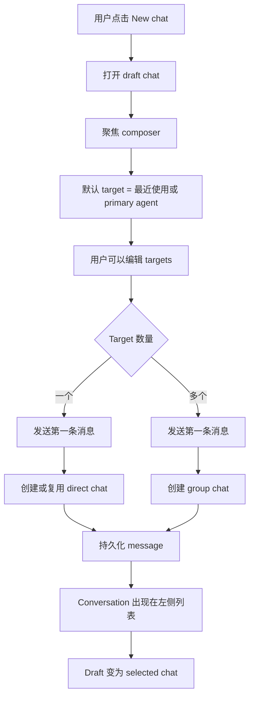

# Chat-First Workspace 产品设计

## 状态

讨论草案。

相关 issue：

- agent-team-foundation/first-tree-all#99
- agent-team-foundation/first-tree-all#103

## 摘要

First Tree Hub Workspace 应从以 agent roster 为中心，转向以 chat/conversation 为中心的协作界面。

左侧只展示 conversations。Agents 和 humans 不再作为 Workspace 左侧导航项，而是在 composer 里的轻量 target picker 中选择。新建聊天不弹出对话框，也不要求用户命名。用户选择一个或多个目标，输入第一条消息并发送，系统根据目标数量创建或复用合适的 chat：

- 一个目标：创建或复用 direct chat；
- 多个目标：创建 group chat；
- group title 根据参与者名称自动生成。

Chat mention 通知显示为 conversation row 上的红点。系统级事件继续留在 notification bell 中。

## 产品模型决策

本设计不引入一套新的独立 chat 业务实体。Workspace 使用 Hub 现有的 chat 模型作为主投影：

```text
Existing persistence
├─ chats
├─ messages
├─ chat_participants
└─ agent_chat_sessions
```

变化点不是新增 chat 模型，而是改变 Workspace 导航由哪个模型驱动。

当前 Workspace 投影：

```text
Workspace left rail
→ agents
→ agent_chat_sessions
→ chat
```

建议后的 Workspace 投影：

```text
Workspace left rail
→ chats
→ participants / messages / read state
```

`agent_chat_sessions` 仍然重要，但它不再是 Workspace 的主导航模型。它的职责调整为 runtime state：

- 某个 agent 在某个 chat 中是否有 active、suspended 或 evicted session；
- 选中 chat 内的 session-level activity 和 controls；
- context panel 中的 runtime details；
- server 与 client 之间的 runtime reconciliation。

简化理解：

```text
Chat = conversation identity and user navigation identity
Agent session = runtime execution state inside a chat
```

原因：

- 一个 group chat 可能包含多个 agents，因此会有多个 agent sessions。如果继续用 `agentId + chatId` 作为主导航 key，同一个 conversation 会被重复展示或被割裂。
- human 可以参与一个 chat，即使当前没有任何 agent session active，这个 chat 也应该出现在 Workspace。
- new-chat draft 在发送第一条消息前还没有 backend chat，更没有 runtime session。session-first 导航会让 draft creation 变得别扭。
- 未来 task chats 应该绑定到 chats，而不是绑定到某个单一 agent session。

本设计唯一需要新增的持久化模型是 member-scoped read state，用于支持 unread mention dots。

## 问题

当前 Workspace 要求用户先从 agent row 开始，再展开到 sessions/chats。这让 agents 成为导航原语，但用户真正想做的是开始或继续一段 conversation。

这带来几个 UX 问题：

- 用户在行动前必须理解 agent/session 结构。
- 现有 chats 像是 agent 管理下的二级内容，而不是主要工作对象。
- group chat 创建没有自然的入口。
- chat mention 和 system notification 混在一起，会干扰用户注意力模型。

## 目标

- 让 conversation 成为 Workspace 的主要导航对象。
- 从 Workspace 左侧移除 agent rows。
- 用户可以不通过 modal 创建 direct chat 和 group chat。
- 用户可以用同一套 picker 交互给已有 chat 加成员。
- unread `@` mentions 直接显示在 conversation rows 上。
- notification bell 只保留 system-level events。
- 为未来 task chats 预留空间，但不依赖 Task primitive。

## 非目标

- 不实现 Task primitive。
- 不实现 task board、task lifecycle 或 task-specific chat filtering。
- 不要求用户在创建 group chat 时命名。
- 不实现完整 IM 管理能力，例如 mute、archive、kick 或 role management。
- 不替代 Team 或 Settings 页面里的 agent 管理能力。

## 产品原则

### Intent First

用户的主动作是表达意图：“做这个”、“总结这个”、“review 这个”。UI 不应该强迫用户先配置 chat，才能开始写消息。

### One Composer

Direct chat、group chat 和未来 task chat 应共享同一个 composer 交互。Target selection 决定 chat shape。

### No Modal By Default

常规 chat creation 应该 inline 发生。Modal dialogs 只用于未来高级设置，不用于第一步 chat creation。

### Chat Is Navigation

Workspace 左侧只导航 conversations。Agents 和 humans 是 conversation workflow 中被选择的协作者。

### Progressive Disclosure

高级 agent 管理属于 Team 或 Settings。Workspace 只暴露开始、恢复和推进协作所需的控制。

## 信息架构

```text
Workspace
├─ Conversation List
│  ├─ New chat
│  ├─ Direct chats
│  ├─ Group chats
│  └─ Future task chats
├─ Chat Surface
│  ├─ New chat draft
│  ├─ Selected chat
│  └─ Welcome suggestions
└─ Composer
   ├─ Target picker in draft chats
   ├─ Participants and add-member control in existing chats
   └─ Message input
```

## 主界面

```text
┌────────────────────────────────────────────────────────────────────┐
│ Workspace / Context / Team / Settings                    Bell User │
├──────────────────────┬─────────────────────────────────────────────┤
│ Conversations        │ New chat                                    │
│                      │                                             │
│ + New chat           │                                             │
│                      │             Hi, I'm code agent              │
│ ● Code Agent         │                Try asking                   │
│   Fix build error    │                                             │
│   2m ago             │   [List my open tasks by priority]          │
│                      │   [Summarize what I did today]              │
│   Design + Gandy     │   [Plan what to work on next]               │
│   Review layout      │                                             │
│   18m ago            │                                             │
│                      │ ┌─────────────────────────────────────────┐ │
│   Product +2         │ │ Tell code agent what to do...           │ │
│   Plan next sprint   │ │ To: code agent ▼                   Send │ │
│   1h ago             │ └─────────────────────────────────────────┘ │
└──────────────────────┴─────────────────────────────────────────────┘
```

## New Chat 流程



## Target Picker

Target picker 是一个可复用组件。它同时支持 single-target 和 multi-target 行为，但不把模式暴露给用户。

Picker 不是 checkbox list。点击 row 即切换选择状态。选中状态用 check icon 和 selected chips 表达。

```text
To: code agent ▼

┌────────────────────────────────────┐
│ [code agent ×] [design agent ×]    │
│ Search people or agents...         │
├────────────────────────────────────┤
│ ✓ code agent            agent      │
│ ✓ design agent          agent      │
│   product agent         agent      │
│   Gandy                 human      │
│   Liu Chao              human      │
└────────────────────────────────────┘
```

规则：

- Draft chat 始终至少有一个 selected target。
- 默认 target 是最近使用的 agent。如果没有历史记录，则使用用户的 primary assistant。
- 选择一个 target 表示 direct chat。
- 选择多个 targets 表示 group chat。
- Enter 切换当前高亮 row 的选择状态。
- 当 search input 为空时，Backspace 删除最后一个 selected chip。
- Escape 关闭 picker。

Collapsed target display：

```text
To: code agent ▼
To: code agent +2 ▼
```

## Group Chat 创建

没有 “Create group chat” dialog。

用户在多选 targets 后发送第一条消息，即创建 group chat。

```text
New chat
→ To: code agent, design agent, Gandy
→ "Please review the homepage copy and implementation"
→ Send
→ Create group chat
→ Persist message
→ Select created chat
```

Group title 自动生成：

- 两个参与者：`Code Agent, Design Agent`
- 三个参与者：`Code Agent, Design Agent, Gandy`
- 超过三个参与者：`Code Agent, Design Agent +2`

自动生成的 title 是 display-only。未来可以通过 inline rename 更新 `chat.topic`，但命名不属于创建流程的一部分。

## 已有 Chat 加成员

已有 chats 在 header 显示 participants。`+` button 打开同一个 picker，但过滤掉已经在当前 chat 中的人和 agents。

```text
┌──────────────────────────────────────────────┐
│ Code Agent, Design Agent +1              +   │
├──────────────────────────────────────────────┤
│ messages...                                  │
└──────────────────────────────────────────────┘
```

Add-member picker：

```text
Add members

┌────────────────────────────────────┐
│ Search people or agents...         │
├────────────────────────────────────┤
│   product agent         agent      │
│   Gandy                 human      │
│   Liu Chao              human      │
└────────────────────────────────────┘
```

行为：

- 选择一个 row 后立即添加该 participant。
- UI 乐观更新。
- 如果 server 拒绝添加，则移除该 row 并显示 inline error。
- 向 direct chat 添加新成员时，系统在后台将其升级为 group chat。UI 只表现为变成了 multi-participant chat，不需要用户理解“升级”概念。

## Conversation List

Conversation list 替代当前 agent roster。

```text
┌────────────────────────────┐
│ Conversations              │
│ + New chat                 │
├────────────────────────────┤
│ ● Code Agent               │
│   Fix homepage layout      │
│   2m ago                   │
├────────────────────────────┤
│   Design Agent, Gandy +2   │
│   Review copied changes    │
│   18m ago                  │
├────────────────────────────┤
│   Product Agent            │
│   Plan next sprint         │
│   1h ago                   │
└────────────────────────────┘
```

Row hierarchy：

1. Unread `@` red dot。
2. Conversation title。
3. Last message preview。
4. Updated time。
5. Optional badges，例如 `group`、`offline` 和未来的 `task`。

## Unread Mentions

Chat mention notifications 是 row-level state，不是 notification-center state。

Unread mention 定义：

- message 属于当前 member 可见的 chat；
- `messages.metadata.mentions` 包含当前 member 的 human agent id；
- `messages.createdAt` 晚于该 member 对此 chat 的 read state；
- message 不是当前 member 的 human agent 发送的。

打开 chat 后标记为 read。

## Notification Model

```text
Conversation row red dot
├─ Unread @mentions in direct chats
└─ Unread @mentions in group chats

Notification bell
├─ agent_error
├─ agent_blocked
├─ agent_stale
├─ agent_disconnected
├─ agent_connected
├─ session_error
├─ session_completed
└─ computer / system / organization events
```

Notification bell 不展示 chat mention notifications。这样 bell 保持为 system-level events 的入口，chat attention 留在 chat list 本地。

## URL Model

推荐 route：

```text
/?c=<chatId>
```

Draft chat route：

```text
/
```

Legacy compatibility：

```text
/?a=<agentId>&c=<chatId>
```

UI 不应再要求必须有 `agentId` 才能渲染 chat。Agent-specific context 应从 chat participants 和 session state 推导。

## API 设计

### List Workspace Chats

```text
GET /admin/chats/workspace
```

Response：

```ts
type WorkspaceChatRow = {
  chatId: string;
  type: "direct" | "group" | "thread";
  title: string;
  topic: string | null;
  participants: Array<{
    agentId: string;
    displayName: string;
    type: "human" | "personal_assistant" | "autonomous_agent";
  }>;
  participantCount: number;
  lastMessagePreview: string | null;
  unreadMentionCount: number;
  updatedAt: string;
  taskId: string | null;
  taskStatus: string | null;
};
```

Task fields 在 Task primitive 落地前保持 `null`。

### Create Chat

```text
POST /admin/chats
```

Body：

```ts
type CreateAdminChatBody = {
  participantIds: string[];
  topic?: string | null;
};
```

规则：

- 当前 member 的 human agent 自动加入。
- 一个非 self participant 时，尽可能创建或复用 direct chat。
- 多个 participants 时创建 group chat。
- 所有 participants 必须对当前 member 可见，且属于 selected organization。

### Add Participants

```text
POST /admin/chats/:chatId/participants
```

Body：

```ts
type AddParticipantsBody = {
  participantIds: string[];
};
```

规则：

- 向 direct chat 添加成员时，必要时升级为 group。
- 已存在的 participants 可以忽略或作为 no-op 返回。
- Server 强制校验 visibility 和 organization boundaries。

### Mark Chat Read

```text
POST /admin/chats/:chatId/read
```

将当前 member 对该 chat 标记为 read。

## 数据模型

新增 member-scoped read state：

```text
chat_read_states
├─ member_id text not null
├─ chat_id text not null
├─ last_read_at timestamptz not null
├─ updated_at timestamptz not null
└─ unique(member_id, chat_id)
```

Indexes：

```text
idx_chat_read_states_member_chat(member_id, chat_id)
```

Unread mention count 可通过 visible chats、messages 和 read state join 计算得到。

## Client SDK 影响

把已有 agent chat 能力暴露为 SDK first-class methods：

```ts
createChat(data: CreateChat): Promise<ChatDetail>
addChatParticipant(chatId: string, agentId: string): Promise<ChatParticipant[]>
removeChatParticipant(chatId: string, agentId: string): Promise<void>
```

Server 已经暴露 agent-side create 和 participant APIs。SDK 需要补齐封装。

## Web Components

新增或调整组件：

- `ConversationList`
- `ConversationRow`
- `NewChatDraft`
- `TargetPicker`
- `ParticipantsHeader`
- `AddMembersPicker`

从 Workspace 主路径中退休：

- `AgentRoster` 作为 primary left rail
- agent-first `?a=` selection 作为渲染要求

## Empty、Loading 和 Error States

### Empty Conversation List

```text
No conversations yet
Start with New chat
```

### Draft Without Network

如果创建失败，message 保留在 composer 中，用户可以重试。

### Offline Target

Offline agents 仍然可选。Composer 显示：

```text
code agent is offline — your message will queue
```

### Permission Failure

如果某个 selected target 不再可用，从 draft 中移除该 target 并显示：

```text
Some targets are no longer available.
```

用户已经输入的 message 保留。

## Accessibility

- Target picker rows 必须支持键盘导航。
- Selection state 必须通过 `aria-selected` 暴露。
- Picker trigger 必须描述当前 selected targets。
- Red-dot unread state 不能只依赖颜色；row 应暴露 accessible label，例如 `1 unread mention`。
- Send button 必须可通过键盘访问。
- Target selection 后 focus 回到 composer。

## 实施计划

1. 添加 `chat_read_states` schema 和 migration。
2. 添加 `GET /admin/chats/workspace`。
3. 添加 `POST /admin/chats`。
4. 添加 admin web 的 multi-add participant endpoint。
5. 添加 mark-read endpoint。
6. 添加 SDK create/add/remove chat participant methods。
7. 用 `ConversationList` 替换 Workspace `AgentRoster`。
8. 添加 `NewChatDraft` 和 `TargetPicker`。
9. 更新 `ChatView` 和 `ContextPanel`，让 `chatId` 成为 primary route state。
10. Notification bell 只保留 system events。
11. 添加 server tests 和 web type checks。

## 验收标准

- Workspace 左侧只包含 conversations。
- Workspace 不展示 agent rows。
- 点击 New chat 后打开 inline draft，并聚焦 composer。
- 默认 target 自动选中。
- 发送给一个 target 时创建或复用 direct chat。
- 发送给多个 targets 时创建 group chat。
- Group chat 创建不打开 dialog，也不要求命名。
- 已有 chats 可以无 dialog 加成员。
- Conversation rows 展示 unread `@` red dots。
- 打开 chat 后清除该 chat 的 unread mention state。
- Notification bell 不展示 chat mention notifications。
- Task fields 存在于 API shape 中，但在 Task primitive 支持落地前为 `null`。

## 开放问题

- 用户 primary assistant 的权威来源是什么？
- Direct chat creation 应始终复用已有 direct chat，还是允许同一个 target 有多个 direct chats？
- Group chat creation 是否应该对完全相同 participants 集合做 dedupe，还是每次都创建新的 group chat？
- Mark-read 应在 chat open 时发生、message list load 完成后发生，还是用户滚动到底部后发生？
- 引用 chat 的 system notifications 是否应跳转到 `/?c=<chatId>`，即使 mention notifications 不进入 bell？

## Context Tree 影响

本设计会把 Workspace 产品模型从 agent-first 改为 chat-first，并改变 chat notifications 与 system notifications 的关系。

如果采用，应在实现 PR 之前或同时更新 Agent Hub / Web Console 对应的 Context Tree 内容。
